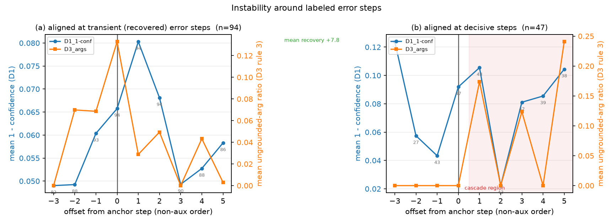

# 라벨 없는 멀티에이전트 실패 탐지: 실행 모델의 logprob과 기록 대조로 handoff·도구 실패를 사후 감사하는 파이프라인과 평가 데이터셋

> 콕스웨이브 AI 리서치 및 제품화 엔지니어 직무과제 제출 문서 (2026-09-09)
> 코드: https://github.com/kangmc1/project-agent · README: `README.md` · 타임라인: `docs/notes/timeline.md`

## 0. 요약

orchestrator가 subagent에게 일을 맡기는 멀티에이전트 시스템에서, 실행 기록만 보고 정답이나 라벨 없이 어느 스텝에서 어떤 실패가 일어났는지 짚어낼 수 있는지를 묻는다. 이를 위해 실행 기록을 결정, 행동, handoff 경계의 세 층으로 나누고 층마다 다른 검사를 둔다. 결정 층에서는 실행 모델이 다음 행동 후보에 매긴 확률을 직접 계산해 결정이 얼마나 흔들렸는지를 재고, 행동 층에서는 도구 호출이 지시문과 주어진 값에 근거한 것인지를 코드로 대조하며, handoff 경계에서는 넘어간 텍스트에서 사실이 얼마나 빠졌는지를 판정 모델로 잰다. 발언 층의 검사는 설계만 하였다. 어느 검사도 정답이나 라벨을 입력으로 받지 않는다(§3.3부터 D1–D4로 부른다).

LangChain Deep Agents 위의 orchestrator→subagent 그래프를 Qwen3-32B로 τ-bench airline 30회 실행하고, 탐지기 출력을 보지 않은 라벨러가 스텝 단위 오류 215건을 달았다. 이 트레이스와 라벨은 과제의 네 실패 유형을 모두 담은 평가 데이터셋으로 함께 제출한다(§3.5). 같은 하네스로 돌린 AIME 2026 30회는 멀티에이전트 과제로 부적합하여 부록 C에 둔다.

orchestrator의 결정이 흔들린 정도는 실패를 부른 스텝을 AUROC 0.75로 가려내지만, 같은 지표가 subagent에서는 우연 수준이다. subagent의 실수는 망설임이 아니라 확신에 찬 잘못된 도구 호출이어서, 행동 근거성 검사가 대신 subagent 오류의 절반 가까이를 정밀도 0.62로 잡고, orchestrator의 위임 호출에서는 정밀도 0.91, 재현율 0.22를 보인다. handoff 정보 손실은 계측으로는 성립하지만(정답지 대비 순위 상관 0.71) 실패 예측력은 약하다. 종합하면 탐지기의 성능은 탐지기 자체보다 어느 역할과 어느 층에 붙이는가에 달려 있으므로, 감사 파이프라인은 역할별로 검사를 배정하는 구조여야 한다. 주된 근거는 한 도메인 당 샘플이 30개로 적고, "값은 맞는데 결론이 틀린" 발언·추론 층은 잡지 못했으며 이것이 가장 큰 미해결 과제다.

## 1. 배경 (Background)

### 1.1 연구 세부 주제

에이전트가 동작하는 과정에서는 다양한 이유로 응답에 오류가 생길 수 있다. 이런 오류가 어디서부터 시작되었고 어떤 유형인지를 탐지하고 수치화하는 것이 중요하다. 이 연구는 orchestrator가 다음 행동을 고를 때의 불확실성, subagent의 도구 호출이 지시와 기록에 근거하는지, 에이전트 사이에 일이 넘어갈 때 정보가 빠지거나 왜곡되는지를 분석하여 오류의 유형과 시작점을 찾는다.

실험은 orchestrator가 과제별 subagent에게 일을 나누어 맡기는 순차 멀티에이전트 시스템에서 이루어진다. 2026년 현재 프로덕션의 기본형인 orchestrator-worker 구조이며, 이 연구에서는 LangChain Deep Agents 하네스로 구성하였다.

실행 중에 orchestrator와 subagent가 낸 모델 호출은 하나하나 스텝으로 기록 데이터베이스에 저장된다. 스텝마다 그 에이전트가 그 순간 받은 메시지 전체, 그에 대한 응답, 그 응답에서 부른 도구와 돌아온 결과가 담긴다. 에이전트마다 받는 메시지가 다르므로 기록도 에이전트별로 따로 쌓이며, 에이전트 사이를 오가는 것은 handoff 메시지와 공유 파일뿐이다. 탐지는 실행이 모두 끝난 뒤 이 저장된 기록 위에서 수행하며, 과제의 정답이나 사람이 단 라벨은 쓰지 않는다. 실행 도중에 끼어들어 막는 가드레일은 이 연구의 범위 밖이다.

이 설정에서 묻는 것은 네 가지다.

1. orchestrator가 다음에 어느 subagent나 도구를 부를지 고르는 행동의 불확실성을 수치화할 수 있는가.
2. subagent의 도구 호출이 orchestrator의 지시와 기록에 주어진 값에 근거한 것인지를 기록만으로 판정할 수 있는가.
3. 에이전트 사이의 handoff에서 생기는 정보 손실이나 왜곡을 탐지하고 수치화할 수 있는가.
4. 위 세 측정값은 orchestrator와 subagent 가운데 어느 쪽의 오류를 실제로 가려내는가. 그리고 각 판정에, 기록의 어느 스텝의 무엇과 어긋났는지를 사람이 확인할 수 있는 근거를 붙일 수 있는가.

### 1.2 현재 에이전트 시스템의 문제 정의

과제가 제시한 네 가지 실패 유형을, 이 시스템의 어느 지점에서 관찰할 수 있는지에 따라 다시 정의한다. 아래 표의 "이 제안의 검사" 열에 쓰인 D1–D4는 §3.3에서 정의하는 탐지기 모듈이다.

| 과제의 실패 유형 | 라벨 범주 (§4.1.3) | 어디서 관찰되는가 | 이 제안의 검사 |
|---|---|---|---|
| handoff 문제 | `handoff` (경계의 결정 · 정보 손실) | orchestrator가 어느 subagent를 부를지 결정하는 지점, 위임 호출의 실행 가능성, 그리고 지시→전제·보고→orchestrator 두 경계의 정보 보존 | D1(handoff 층) + D2(orchestrator 조건: 식별자 없는 위임, 실패 보고 뒤 재위임) + D3(경계 정보 손실, LLM 비교) |
| 도구 사용 실패 | `tool` (행동 근거성) | subagent가 handoff 안에서 부른(또는 부르지 않은) 도구와 그 인자가, 기록이 요구하고 허용한 것인가 | D2(세 가지 어긋남: 기록이 요구한 호출을 하지 않음, 기록에 없는 값으로 호출함, 호출이 성립하지 않음) + D1(도구 층, orchestrator) |
| 환각 | `reasoning_stability` (기록이 지지하지 않는 결론, 통합) | 도구 호출 인자의 값이 에이전트에게 주어진 기록에 있는가 | D2의 어긋남 (2)와 그 증상인 (3′). 발언 속 값과 결론의 근거 층은 탐지기가 없다(D4는 설계만, §3.3) |
| 추론 오류 | `reasoning_stability` (기록이 지지하지 않는 결론, 통합) | 발언의 결론이 근거 값에서 따라 나오는가 | 이번 연구에는 탐지기가 없다. D3은 경계에서 사실이 빠지는지만 보고 결론의 도출은 보지 않으며, 이 층을 겨눈 D4는 설계만 남겼다(§3.3, §4.3) |

환각과 추론 오류를 하나의 범주로 묶은 이유는 세 가지다. 첫째, 스텝 시점에서 "지어낸 값"과 "잘못 계산한 값"은 구분되지 않는 경우가 많고, 사람 어노테이터 사이의 일치도도 낮다(MAST, Who&When의 세부 유형 κ). 둘째, 운영에서 중요한 것은 "이 결론을 믿어도 되는가"이며 원인 분류는 사후 태그로 충분하다. 셋째, 두 유형 모두 "근거로 지지되지 않는 결론이 궤적에 유입된다"는 하나의 사건이다.

### 1.3 차별점 (Novelty)

1. **실행 모델의 실제 확률로 유한 행동 집합 위의 분포를 계산한다.** 공개 트레이스 벤치마크(Who&When, TraceElephant)는 GPT-4o의 출력만 남아 있어 다른 모델로 다시 재생해야 한다. 이 제안은 실행과 채점에 같은 가중치, 같은 채팅 템플릿, 같은 도구 스키마를 쓴다. 샘플링이 필요 없고, 결정 지점마다 후보 수만큼의 짧은 채점으로 끝난다(§3.3).
2. **판정 주체를 층에 맞춘다.** 결정 층(D1)과 행동 층(D2)은 코드가 판정한다. 도구 호출은 구조화된 기록이라 문자열 대조가 LLM 판정보다 정밀하였고(§4.2.13), 모든 플래그에 어느 스텝의 어느 값과 어긋났는지를 가리키는 근거 포인터가 붙는다. 경계 층(D3)은 자연어 두 텍스트의 비교이므로 LLM이 판정한다. 같은 손실 정답지에서 LLM 직접 비교가 사실 추출 후 집합 비교보다 정확하였기 때문이다(§4.2.12). 어느 층에 어느 판정 주체가 맞는지를 데이터로 정한 것이 이 제안의 방법론적 특징이다.
3. **탐지기는 정답과 라벨을 입력으로 받지 않는다.** 임계값도 자기 분포의 백분위로 정하고, 라벨은 이 실험의 평가에만 쓴다. 이 조건이 갖추어져야 성공·실패가 섞인 운영 로그를 사후에 검토하는 제품에 바로 적용할 수 있다. 다만 두 가지 단서가 있다. D2의 지시→도구 매핑 규칙에 있던 오류는 라벨과 대조한 오탐을 보고 고쳤으며(부록 A.19), 백분위 임계값은 D1에서 재현율을 크게 낮추어 라벨 없이 시작하는 운영의 실용성이 §4.2.6에서 확인된 것보다 약하다.
4. **성공 트레이스가 있다.** 실패 트레이스만 모은 귀속 벤치마크로는 잴 수 없는 오탐율과 회복(transient 대 decisive) 분석이 가능하다. 다만 주 실험의 성공 실행은 6회여서 실행 단위 분석의 신뢰구간은 넓다.

5. **네 유형을 모두 라벨한 완전 관측 데이터셋과 그 생성 파이프라인을 남긴다.** 공개 트레이스 벤치마크가 모델의 출력만 담는 것과 달리, 이 데이터셋은 모델이 실제로 본 입력, 도구 호출과 결과 원문, 공유 파일 스냅샷까지 담고 성공 실행을 포함한다. 탐지기가 담당하지 않는 추론 오류 층에도 라벨이 있어(§3.5), §4.3의 미해결 과제를 같은 데이터셋 위에서 같은 지표로 이어갈 수 있다. 라벨은 모델이 달았으므로 사람 라벨의 대체가 아니라 출발점이며, 그 한계는 §4.3에 있다.

위 다섯 가지는 설계의 조건이다. 이 조건 위에서 얻은 발견, 곧 탐지기의 성능이 탐지기 자체보다 어느 역할과 어느 층에 붙이는가에 따라 갈린다는 점이 이 연구의 결과 측 기여이며 §4.2 핵심 결과의 세 번째 문장이다.

## 2. 기존 연구 (Related Work)

| 계열 | 대표 연구 | 요지 | 이 제안과의 관계 |
|---|---|---|---|
| 실패 귀속 벤치마크 | Who&When (ICML'25), TraceElephant (ACL'26) | 실패한 멀티에이전트 트레이스에서 책임 에이전트와 결정적 스텝을 맞히는 과제. TraceElephant는 입력까지 담은 완전 관측 트레이스로 귀속 정확도를 최대 76 % 높였다 | 두 벤치마크는 실패 트레이스만 담아 오탐율 개념이 없고, 확률은 다른 모델로 근사한다. 이 제안은 직접 실행으로 두 한계를 피하며, "완전 관측이 필요하다"는 결론은 공유한다 |
| 트레이스 오류 분류 | TRAIL (2025), MAST (2025), AgentErrorTaxonomy (2025) | span·스텝 단위 오류 분류체계. 추론(환각·정보처리·결정), 시스템, 계획·조정으로 나누며 MAST는 14개 모드(이력 손실, 추론-행동 불일치, 검증 실패 등), AET는 17개 유형(요약 손실, 거짓 기억, 진행 오판 등)을 제시한다 | 라벨 규약(rubric)과 "발언 대 기록" 검사 항목의 근거 |
| 귀속 방법 | CHIEF (2026.02) 등 | 인과 그래프 역추적으로 Who&When 최고 성능 | LLM의 국소 판정과 역추적을 결합한 계열. 이 제안은 판정을 확률 계산과 기록 대조로 대체한다 |
| 멀티에이전트 환각 | Hallucination Cascade (2026.06), Context Drift (2026.06) | 환각을 에이전트 사이의 상태 불일치(context drift)로 다시 해석하고 주장 단위로 추적한다 | "발언 대 기록 불일치" 원리의 배경 |
| 불확실성 기반 탐지 | semantic entropy, SelfCheckGPT | 반복 생성의 불일치로 환각을 탐지한다 | 샘플링에 기반한다. 이 제안은 유한 행동 집합에서만 불확실성을 쓰고, 텍스트 환각에는 쓰지 않는다(과신 환각에 취약하기 때문) |
| 오케스트레이션 | Magentic-One (2024), LangChain Deep Agents (2025–26), OpenAI Agents SDK | orchestrator-worker가 2026년의 기본형이다. Deep Agents는 orchestrator, `task` 도구로 부르는 subagent, 공유 파일시스템, todo로 구성된다 | 실험 환경이다. 단, 내장 `task` 도구는 어느 subagent를 부르는지를 인자 안에 두므로, 이 제안은 subagent마다 이름을 가진 래퍼 도구로 노출한다(§3.1) |

## 3. 제안 (Methodology & Benchmark)

### 3.1 실행 환경: Deep Agents 위의 orchestrator→subagent 그래프

**τ-bench airline이란.** τ-bench(Sierra Research, 2024)는 도구를 쓰는 에이전트를 시뮬레이션 고객과의 대화 속에서 평가하는 공개 벤치마크이며, τ-bench airline은 그 가운데 항공사 고객 응대 도메인이다. 에이전트는 문서로 주어진 항공사 정책을 지키면서 시뮬레이션 고객과 대화하고, 예약 데이터베이스를 조회·수정하는 도구 14개(`get_user_details`, `get_reservation_details`, `search_direct_flight`, `search_onestop_flight`, `book_reservation`, `update_reservation_flights`, `update_reservation_baggages`, `update_reservation_passengers`, `cancel_reservation`, `send_certificate`, `calculate`, `list_all_airports`, `transfer_to_human_agents`, `think`)로 과제를 수행한다. 대화가 끝난 뒤 데이터베이스의 최종 상태가 정답 상태와 같으면 성공이다.

τ-bench airline을 아래 구조의 그래프로 실행한다.

```
[τ-bench airline]
 고객(시뮬레이터, 같은 모델) ⇄ orchestrator ─┬─ policy_checker (think 도구 + 시스템 프롬프트에 담긴 정책 문서)
 respond_to_user 도구로만 대화 ├─ db_agent (τ-bench airline 도구 14개)
 └─ read_file / write_file (공유 파일 /case_notes.md)
```

- **subagent는 이름을 가진 래퍼 도구다.** orchestrator는 `policy_checker`, `db_agent`라는 이름의 도구를 부르고, 그 도구가 해당 subagent 그래프를 실행한 뒤 보고서를 도구 결과로 돌려준다. Deep Agents의 내장 `task` 도구를 쓰지 않은 이유는, `task`가 어느 subagent를 부르는지를 자유 텍스트 뒤의 인자(`subagent_type`)에 두어 D1이 "누구를 부르는가"의 확률을 잴 수 없기 때문이다. 내장 `task`는 `SubAgentMiddleware`를 추가하지 않는 설정으로 제거하였고, 래퍼는 `task`의 상태 규약을 따라 부모 상태를 subagent에 넘기고(제어용·비공개 키는 제외) 실행 후 공유 파일 상태(`files`)를 부모에 병합한다. `todos`는 이 규약상 공유되지 않는다.
- **각 에이전트가 쓸 수 있는 도구.** orchestrator는 두 래퍼와 `respond_to_user`(고객에게 말하고 답을 받는 도구), 그리고 Deep Agents의 파일 도구 `read_file`·`write_file`을 쓴다. orchestrator는 데이터베이스에 직접 접근하지 않는다. `policy_checker`는 사고용 `think` 도구와 파일 도구를 쓰며, 항공사 정책 문서는 시스템 프롬프트에 들어 있다. `db_agent`는 τ-bench airline 도구 14개와 파일 도구를 쓴다. 나머지 내장 파일 도구(`ls`, `glob`, `grep`, `execute`, `edit_file`, `delete`)는 모든 그래프에서 제거하였다.
- **공유 파일과 요약.** τ-bench airline에서는 subagent가 작업을 끝내기 전에 공유 파일 `/case_notes.md`에 결과를 덧붙이고 orchestrator가 그것을 읽는다. 대화가 길어질 때를 위한 요약 미들웨어는 orchestrator와 각 subagent 그래프에 하나씩 있으며, 문맥이 16,000토큰에 이르면 최근 8개 메시지를 남기고 요약한다. 요약 호출은 기록에 `summarizer`라는 별도 에이전트 이름으로 남지만, subagent가 아니라 미들웨어다.
- **모델과 시뮬레이터.** 실행 모델은 Qwen3-32B(vLLM, thinking 비활성)이고, 고객 시뮬레이터도 같은 모델이다. 시뮬레이터는 τ-bench의 LLM 사용자 시뮬레이터를 같은 시스템 프롬프트로 다시 구현한 것으로, 요청 본문을 캡처하기 위해 HTTP 클라이언트를 직접 쓴다(§4.3 한계).
- **종료 조건.** 고객이 대화를 끝내거나 30턴 또는 20분에 이르면 끝난다. LangGraph의 재귀 한도는 200이다.
- **두 번째 도메인.** 같은 하네스로 AIME 2026 그래프(orchestrator → `solver`, `verifier`)도 30회 실행하였다. 그러나 solver가 풀이의 거의 전부를 수행하고 orchestrator의 실질적 결정이 적어(라벨된 orchestrator 오류 6건) orchestrator→subagent 분해가 형식적이었으므로 본문에서 빼고, 그래프 구조와 결과를 부록 C에 둔다.

### 3.2 완전 관측 기록

탐지기가 읽는 것은 실행 기록이며, 그 기록을 다음과 같이 남긴다. 스텝(LLM 호출 한 번)마다 HTTP 계층에서 요청 본문(messages, tools 스키마)과 응답 본문(content, tool_calls, 생성 토큰의 logprob, finish_reason)을 그대로 저장하고, 어느 에이전트의 호출인지는 요청 헤더로 기록한다. 도구 호출과 결과는 SQLite에, 공유 파일과 todo는 스텝별 스냅샷으로, 요약 직전의 원문도 함께 보존한다. 여기서 logprob은 모델이 각 토큰에 매긴 로그 확률이다. 탐지기는 이 기록 이외의 어떤 정보도 입력으로 받지 않는다.

### 3.3 탐지기 구성: 네 모듈

이 제안의 탐지기는 네 모듈로 이루어진다. Dn의 D는 탐지기(detector) 모듈의 번호다. 설계 인터뷰에서 제시한 점검 차원 번호에서 출발하였으나, 최종 문서에서는 결과에 쓰인 순서로 다시 붙였다(D1 결정, D2 행동, D3 handoff; D4는 설계만). 설계만 남긴 선택 모듈 D6·D8·D10은 원래 번호를 유지한다.

네 모듈은 실행 기록의 서로 다른 층을 서로 다른 상대와 대조한다.

| 모듈 | 대상 | 대조 상대 | 판정 주체 | 한 문장 |
|---|---|---|---|---|
| D1 결정 분포 | 행동 선택 | 모델 자신의 확률 분포 | 코드 | 결정이 얼마나 흔들렸는가 |
| D2 행동 근거성 | 행동(도구 호출) | 기록(지시문, 주어진 값) | 코드 | 이 행동은 기록이 요구하고 허용한 것인가 |
| D3 handoff 정보 손실 | handoff 텍스트 | 경계 반대편의 텍스트 | LLM (gpt-oss-20b) | 넘기는 과정에서 어떤 사실이 빠지거나 바뀌었는가 |
| D4 근거 의존 판정 [설계만] | 발언 | 근거(도구 결과, 지시문) | 외부 LLM | 말한 것이 근거에 얼마나 의존하는가 |

D2와 D4는 같은 기록을 놓고 하나는 행동을, 하나는 발언을 대조한다. 행동(도구 호출)은 구조화된 JSON이므로 코드로 대조할 수 있고, 발언은 자연어이므로 LLM이 필요하다. 이번 실험에서 코드 대조(D2)는 정밀하게 작동하였고, LLM 대조(D4)는 8B 모델로는 실패하였다(§4.2, §4.3).

스텝 하나를 [결정] → [행동: 도구 호출] → [발언]의 세 층으로 나누고, 스텝 사이에 handoff 경계를 두면 결과에 쓰인 세 모듈은 다음 자리에 놓인다.

```
 층 모듈 한 문장 판정 주체
 ───────────── ────────────────────── ──────────────────────────────────────── ──────────────
 결정 D1 결정 분포 후보 행동 위의 확률 분포가 얼마나 퍼졌는가 코드
 행동(도구) D2 행동 근거성 호출이 기록이 요구하고 허용한 것인가 코드
 handoff 경계 D3 handoff 정보 손실 경계를 넘으며 어떤 사실이 빠지거나 바뀌었는가 LLM (gpt-oss-20b)
 발언·추론 (탐지기 없음 — D4 설계만)
```

출력은 모듈별 플래그와 근거 포인터이며, 이를 트레이스별 보고서와 시스템 단위 집계로 정리한다(§4.2.11). 모듈을 합친 통합 점수는 내지 않는다. 설계만 하고 결과에 쓰지 않은 선택 모듈은 D4 외에 D8 축약 손실(요약 전후의 원자 사실 비교), D10 계획-행동 일치(todo와 실제 호출의 비교), D6 재도출(정책 규칙 코드와 재계산)이 있다.

**D1 — 결정 분포**

- 목적: orchestrator 또는 subagent가 다음 행동을 고르는 지점에서, 실행 모델이 후보들에 매긴 확률 분포가 얼마나 흔들렸는지를 잰다.
- 입력: 결정 지점(assistant 스텝)의 렌더된 문맥과 후보 집합 A. A는 그 스텝에 바인딩된 도구 이름들과 `no_tool`(도구를 부르지 않고 말하는 행동)의 합집합이다.
- 계산: 문맥을 고정하고 후보 a의 토큰열(`<tool_call>\n{"name": "a`)만 바꾸어 넣어 log P(a | 문맥)을 얻는다. 실제로는 후보 토큰을 한 개씩 `allowed_token_ids`로 강제한 1토큰 생성의 logprob을 합해 계산하며, 이렇게 하면 vLLM의 prefix cache(앞부분 계산 결과의 재사용)가 유지된다(§4.1.5).
- 출력: A 위의 정규화 분포, 엔트로피 H, confidence = 1 − H / log|A|, 실제 선택된 행동의 확률 p_actual, 1등과 2등의 확률 차 margin. 점수는 1 − p_actual, 1 − confidence, 1 − margin이며 클수록 불안정하다. orchestrator에서는 "subagent에 넘길지 말지"만 보는 handoff 층 값을 따로 낸다.
- 코드: `src/audit/d1_decision.py`, 출력 `audit/d1.jsonl`.

**D2 — 행동 근거성**

- 목적: 한 스텝의 도구 호출이 기록이 요구하고 허용한 행동인지를 코드로 판정한다. 하나의 질문에 대한 세 가지 어긋남을 본다.
- 입력: orchestrator의 지시문, 해당 handoff 안의 도구 호출 목록, 호출 인자, 에이전트가 그 요청에서 받은 메시지(system, user, tool), 도구가 돌려준 결과.
- 계산: 다음 셋 중 하나라도 성립하면 1, 아니면 0이다.
 - (1) 기록이 요구한 호출을 하지 않음. 지시문이 요구하는 도구 군(조회, 검색, 예약, 변경, 취소, 계산, 가격 등 12군)을 정규식으로 뽑아, subagent가 handoff 안에서 실제로 부른 도구와 대조한다. 하나라도 빠지면 subagent의 보고 스텝에 1을 준다.
 - (2) 기록에 없는 값으로 호출함. 호출 인자에서 식별자형 값(예약번호, 사용자 ID, 편명, ISO 날짜, 금액, 공항 코드, 이름)을 뽑아, 그 값이 에이전트에게 주어진 메시지나 이전 고객 발화에 있는지 확인한다. 공항은 도시명, 날짜는 자연어 표기도 근거로 인정한다.
 - (3′) 호출이 성립하지 않음. 도구가 오류를 돌려준 호출이다. 아직 만들어지지 않은 공유 파일을 처음 읽는 `read_file`의 오류와 래퍼 행의 오류는 제외한다. 이 어긋남은 대부분 (2)의 증상이다(기록에 없는 값으로 부른 호출이 "user not found"로 돌아오는 경우).
 - orchestrator의 위임 호출에는 같은 질문을 두 조건으로 묻는다. (a) 위임이 예약·사용자 조회나 변경을 요구하는데 예약번호도 사용자 ID도 담지 않았다. τ-bench airline에는 이름으로 예약을 찾는 도구가 없어 기록이 실행을 허용하지 않는 호출이다. (b) 같은 subagent의 직전 보고가 실패나 불가능을 알렸는데 거의 같은 위임을 다시 냈다(정규화 유사도 0.8 이상, 새 식별자 없음). 위임문 안의 지어낸 값은 (2)가 이미 검사한다.
- 출력: 스텝마다 0/1 플래그와, 어느 어긋남이 왜 걸렸는지의 근거 문자열.
- 제외한 것: 발언의 숫자 주장에 도구 근거를 요구하는 규칙(발언 층의 문제), 도구 호출 결과의 처리에 관한 로그 검사(반복, 무시, 빈 결과, 스키마 위반). 결과를 잘못 다뤘는지는 로그 흐름만으로 판정할 수 없다(§4.2.9).
- 코드: `src/audit/d2_required_calls.py`(1), `src/audit/d2_argument_grounding.py`(2), `src/audit/d2_tool_log.py`(3′의 원자료), `src/audit/d2_delegation.py`(orchestrator 조건 a·b), 합성 `src/audit/d2_action.py`, 출력 `audit/d2_action.jsonl`.

**D3 — handoff 정보 손실**

- 목적: orchestrator와 subagent 사이의 두 경계에서 전이 전 텍스트의 사실이 전이 후 텍스트에 얼마나 남았는지를 잰다. 실패 예측기가 아니라 정보 손실의 계측기이며, 평가는 손실 정답지에 대해 한다(§4.2.12).
- 입력: 지시→전제 방향은 orchestrator의 지시문(A)과 subagent의 첫 발언(B), 보고→orchestrator 방향은 subagent의 최종 보고(A)와 orchestrator의 다음 발언 및 도구 호출 인자(B). B는 전이 직후의 한 스텝으로 한정한다.
- 계산: 판정 모델(gpt-oss-20b, 실행 모델과 다른 계열)이 두 텍스트를 직접 비교한다. A의 구체적 사실(식별자, 값, 날짜, 금액, 상태, 결론, 제약)을 나열하고 각각을 B에서 보존·누락·변형으로 표시한 뒤 fidelity = 보존 / 전체를 낸다. 사실 추출 후 코드가 집합을 비교하는 방식과 원문 값 토큰의 겹침 비율은 비교군으로 남겼다(`src/audit/comparators/`).
- 출력: 경계마다 fidelity(0–1)와 누락·변형된 사실 목록. 점수는 1 − fidelity(손실률)이며 클수록 손실이 크다.
- 제외한 것: B에만 있는 내용(받은 쪽이 새로 만든 판단·질문)은 손실이 아니므로 세지 않는다. 그래서 대칭 지표(Jaccard)가 아니라 A 기준 비율을 쓴다.
- 코드: `src/audit/d3_handoff.py`, 출력 `audit/d3_handoff.jsonl`. 판정 서버는 `scripts/serve_gptoss20b.sh`.

**D4 — 근거 의존 판정 [설계만, 결과 미사용]**

- 목적: subagent의 발언이 자기 근거에 실제로 의존하는지를 LLM이 판정하고 구조화한다. "값은 맞는데 결론이 틀린" 발언 층을 잡을 유일한 후보다.
- 입력: (A) 그 요청에서 subagent가 받은 근거(도구 결과와 orchestrator 지시문), (B) subagent의 응답.
- 계산: 판정 모델이 응답을 원자 주장으로 나누고, 주장마다 `supported`(근거에 그대로 있음), `derived`(근거 값에서 계산·환산·요약됨), `unsupported`(근거와 지시에서 얻을 수 없음), `contradicted`(근거와 충돌) 가운데 하나를 붙인다.
- 출력: 스텝 점수 = (unsupported + contradicted) / 주장 수.
- 비고: 이 모듈에서는 LLM이 판정자다. D3의 LLM 판정이 두 자연어 텍스트 사이의 사실 보존을 비교하는 것과 달리, D4는 발언의 옳고 그름 자체를 LLM에 묻는다. Qwen3-8B로 돌린 파일럿은 판정 신뢰도가 부족하여 결과에 쓰지 않았다(§4.3 한계, 부록 A.20).
- 코드: `src/audit/unused/d4_evidence_judge.py`.

### 3.4 라벨 없는 운영을 위한 설계

- 탐지기의 입력에 정답, 보상(reward), 라벨이 없다. 임계값은 모듈별 자기 분포의 백분위(상위 5 % 또는 10 %)로 정한다.
- 모든 플래그에 근거 포인터가 붙어 사람 검수 루프(순위 → 소량 검수 → 임계값 갱신)에 들어간다.
- 전제 조건은 완전 관측 로깅 계약이다. 도구 결과, 모든 메시지, 모델이 실제로 본 입력, 실행 모델의 logprob 접근이 필요하다. 출력만 남는 로그에서는 D1·D2·D3이 동작하지 않는다.

### 3.5 평가 데이터셋과 생성 파이프라인

탐지기와 함께 제안하는 것은 탐지기를 평가하는 데이터셋과 그 데이터셋을 만드는 파이프라인이다. 과제가 제시한 네 유형을 모두 라벨하였으므로, 이번 연구의 탐지기가 담당하지 않는 층(발언·추론)에 대한 후속 탐지기도 같은 데이터셋 위에서 같은 지표(§4.1.4)로 평가할 수 있다.

**구성.** 트레이스는 §3.2의 완전 관측 기록이며, 라벨은 §4.1.3의 프로토콜로 달았다.

| 구성 요소 | τ-bench airline | 위치 |
|---|---|---|
| 완전 관측 트레이스 (성공 / 실패) | 30 (6 / 24) | `runs/<run_id>/` (원본은 스크립트로 재생성), 요약 `summary.md` |
| 라벨 대상 스텝 | 826 | `labels/index.csv` |
| 오류 이벤트 — `handoff` | 77 | `labels/<run_id>.json` |
| 오류 이벤트 — `tool` | 82 | 〃 |
| 오류 이벤트 — `reasoning_stability` (환각·추론 오류, 통합) | 56 | 〃 |
| 이벤트 필드 | 회복 여부·회복 스텝·근거 인용 (회복된 이벤트 48건), decisive step (실행 24건) | 〃 |
| handoff 정보 손실 정답지 | 60 handoff (지시→전제 30, 보고→orchestrator 30) | `labels/d3_loss/` |
| 라벨 규약과 품질 관리 | 범주 정의, 반복 규약, 파생 스텝 클래스, 스팟체크 6건 (decisive 일치 6/6, 이벤트 Jaccard 0.56) | `labels/RUBRIC.md`, `labels/spotcheck/` |

부록 C의 AIME 2026(트레이스 30건, 이벤트 219건)도 같은 형식으로 라벨되어 있으므로, 두 도메인을 합치면 트레이스 60건, 이벤트 434건이다.

과제의 네 유형과 라벨 범주의 대응은 §1.2의 표와 같다. 환각과 추론 오류는 `reasoning_stability` 하나로 묶고 세부 태그(`hallucination_like`, `reasoning_like`)로 구분한다.

**생성 파이프라인.** 새 도메인이나 새 실행 모델로 데이터셋을 다시 만드는 절차는 다음 다섯 단계이며, 모두 부록 B의 명령으로 재현된다.

1. 실행: 고정 시드의 과제 표본을 하네스로 실행하고, 성패를 과제 정답(τ-bench airline은 보상 1.0)으로 기록한다.
2. 캡처: 스텝마다 모델이 본 입력 전체, 응답, 도구 호출과 결과 원문, 공유 파일 스냅샷을 남긴다(§3.2).
3. 요약: 트레이스를 라벨러용 `summary.md`로 렌더한다. 탐지기 산출물은 포함하지 않는다.
4. 블라인드 라벨링: 라벨러(이번 연구에서는 Claude 서브에이전트)가 규약에 따라 이벤트, 회복, decisive step을 단다. 정답과 보상은 보되 탐지기 출력은 보지 않는다.
5. 검증: 스키마·참조 검사(`python -m src.eval.labels --validate`)와 독립 재라벨 스팟체크로 일치도를 잰다.

**공개 벤치마크와 다른 점.** Who&When과 TraceElephant는 실패 트레이스만 담고 모델의 출력만 남아 있어 오탐율과 회복 분석이 없고, 실행 모델의 확률을 다른 모델로 근사해야 한다(§2). 이 데이터셋은 성공 실행을 포함하고 입력과 도구 결과 원문을 담으며, 같은 가중치로 다시 채점할 수 있다. 대신 규모가 작고 라벨러가 사람이 아니라는 한계가 있다(§4.3).

## 4. 결과 및 평가 (Evaluation)

### 4.1 실험 설계

#### 4.1.1 실험 대상 시스템 (system under test)

Deep Agents(`deepagents 0.7.13`) 위의 그래프를 §3.1의 구조대로 실행한다. subagent는 모두 이름을 가진 래퍼 도구다.

| 항목 | τ-bench airline |
|---|---|
| orchestrator 도구 | `policy_checker`, `db_agent`, `respond_to_user`, `read_file`, `write_file` |
| subagent 도구 | `policy_checker`: `think`(정책 문서는 시스템 프롬프트) / `db_agent`: τ-bench airline 도구 14개; 둘 다 `read_file`, `write_file` |
| 공유 FS | `/case_notes.md`(subagent가 append) |
| 사용자 | 같은 모델로 구현한 HTTP 직접 호출 시뮬레이터(`user_sim`) |
| 종료 조건 | `done` 또는 30턴(`MAX_TURNS`), `recursion_limit=200` |

도구 개수 14는 `tau_bench/envs/airline/tools/`의 모듈 수이며, 나머지 구성은 `src/harness/airline.py`에 있다(AIME 2026은 `src/harness/aime.py`, 부록 C). orchestrator에서 `task`, `ls`, `glob`, `grep`, `execute`, `edit_file`, `delete`를 제거하였으므로 D1의 후보 집합에는 위 표의 도구만 남는다(`docs/notes/deepagents_probe.md`에서 노출 도구가 `read_file`, `write_file`과 바인딩된 래퍼·도메인 도구뿐임을 확인하였다).

서빙 설정(장비 배치, 포트)은 `scripts/serve_*.sh`에 있다.

| 서버 | 모델 | GPU | 포트 | 파라미터 |
|---|---|---|---|---|
| 실행 | Qwen3-32B | 1–2 | | `--max-model-len 40960 --max-num-seqs 16 --max-num-batched-tokens 8192 --enable-prefix-caching --enable-auto-tool-choice --tool-call-parser hermes --gpu-memory-utilization 0.90 --dtype bfloat16` |
| 추출 | Qwen3-8B | 3 | | `--max-model-len 32768 --max-num-seqs 32 --tool-call-parser hermes --gpu-memory-utilization 0.90` |
| 채점 | Qwen3-32B | 4 | | `--max-model-len 24576 --max-num-seqs 1 --max-num-batched-tokens 2048 --enable-prefix-caching --gpu-memory-utilization 0.90` |

모든 클라이언트는 `temperature=0`, `max_tokens=2048`, `logprobs=True`, `disable_streaming=True`, `enable_thinking=False`로 호출하며, 어느 에이전트의 호출인지는 `X-Agent` 헤더로 기록한다(`src/harness/model.py`). 요약 미들웨어는 orchestrator와 모든 subagent 그래프에 하나씩 붙으며, 문맥이 16,000토큰에 이르면 최근 8개 메시지를 남기고 요약한다(`trigger=("tokens", 16000)`, `keep=("messages", 8)`; `docs/notes/deepagents_probe.md`).

#### 4.1.2 실행 규모

실행 규모와 성패 판정 기준은 다음과 같다.

- 과제. τ-bench airline은 테스트 과제 30건이다. 배치 1은 id 2–24 범위의 15건, 배치 2는 id 25–48 범위의 15건이다. 시드를 고정한 표본을 미리 저장하였다(`data/tau_task_ids.json`).
- 실행 순서. 배치 1(15)을 완주한 뒤 배치 2(15)를 실행하였다. 총 30회다. AIME 2026도 같은 배치 구조로 30회 실행하였다(부록 C).
- 모집단. `runs/index.csv`는 두 도메인 62행이다. `batch=0`인 `airline_000`과 `aime_000` 두 건은 파이프라인 점검용 예비 실행(스모크 실행)이므로 라벨과 평가 모집단에서 제외한다. 남은 60건이 `labels/index.csv`의 60행과 일치하며, 그중 τ-bench airline 30건이 본문의 모집단이다.
- 성패 판정. `runs/index.csv`의 `success` 열로 판정한다. τ-bench의 보상 1.0이 성공이다. `status` 열은 62건 모두 `ok`이므로, 실패는 모두 하네스 오류가 아니라 에이전트의 과제 실패다.

| 도메인 | n | 성공 | 실패 | 성공률 | 스텝 수 합 | 스텝 수 중앙값(범위) |
|---|---|---|---|---|---|---|
| τ-bench airline | 30 | 6 | 24 | 0.200 | 1029 | 31.5 (5–88) |

실패가 다수이지만 성공 실행이 있으므로 오탐율과 회복 분석이 성립한다. 실패 트레이스만 담은 귀속 벤치마크에서는 이 분석이 불가능하다(§1.3). §4.2의 표는 모두 τ-bench airline 셀이다. AIME 2026의 실행 규모와 결과, 두 도메인 합산 셀은 부록 C에 있다.

#### 4.1.3 라벨링 프로토콜

라벨은 평가의 기준이며 탐지기의 입력이 아니다. 라벨링 절차는 다음과 같다.

- 어노테이터. Claude 서브에이전트가 배치당 6명씩 5개 실행을 나누어 맡아 총 60개 실행을 라벨하였다. 입력은 `runs/<run_id>/summary.md` 하나이며, 여기에는 스텝 순서, 발언, 도구 호출과 결과, 고객 발화, 최종 성패가 담긴다. 탐지기 산출물(`audit/`)은 열람을 금지하였고(블라인드), 정답과 보상은 열람을 허용하였다.
- 범주(`labels/RUBRIC.md`). `handoff`(경계에서 정보가 유실·변형·추가됨), `tool`(잘못된 도구나 인자, 오류 무시, 필수 조회 누락, 무의미한 반복), `reasoning_stability`(기록이 지지하지 않는 결론)의 세 범주다. 세부 태그(subtag)는 `hallucination_like`, `reasoning_like`, `handoff_induced`, `compression_induced`다.
- 이벤트 필드. 이벤트마다 회복 여부(`recovered`), 회복 스텝(`recovery_step`), 어긋난 기록의 인용(`evidence`)을 필수로 받는다. `decisive_step`은 실패로 이어지는 첫 미회복 이벤트다.
- 파생 스텝 클래스. `clean`(깨끗한 스텝), `transient`(회복된 오류), `decisive`(결정적 오류), `cascade`(decisive 이후의 스텝으로, 탐지 채점에서 제외하고 지연 계산에만 쓴다), `error`(그 외 미회복, 예를 들어 성공 실행의 미회복 이벤트)의 다섯 가지다.
- 반복 규약(RUBRIC §5b). 같은 잘못된 값, 주장, 호출이 뒤 스텝에서 다시 나오면 스텝마다 별도 이벤트로 라벨한다. 반대로 subagent의 보고를 변형 없이 중계만 하는 orchestrator 스텝은 라벨하지 않는다. 잘못된 내용이 나오는 모든 스텝이 탐지기가 울려야 하는 스텝이라는 것이 근거다. 이 규약은 스팟체크 직후인 2026-에 고정하였다.
- 스팟체크. 6개 실행(`airline_002`, `airline_013`, `airline_021`, `aime_003`, `aime_008`, `aime_012`)을 독립적으로 다시 라벨하였다. `decisive_step`은 6건 모두 일치하였고, 이벤트 스텝 집합의 Jaccard 유사도(두 집합의 교집합 크기를 합집합 크기로 나눈 값)는 평균 0.563이었다(`labels/spotcheck/agreement.json`). 불일치는 모두 두 번째 어노테이터의 이벤트가 첫 어노테이터의 부분집합이었던 경우로, 반복 방출과 하류 사용을 라벨하지 않은 데서 나왔다. 라벨을 다시 쓰는 대신 위의 반복 규약을 고정하는 것으로 해소하였고, 배치 2는 그 규약 아래 라벨하였다.
- 라벨 컷. 라벨을 확정한 시점에 60개 실행 모두 `python -m src.eval.labels --validate`를 통과하였다(오류 0, 경고 0). τ-bench airline은 215개 이벤트, decisive_step이 있는 실행 24건, 라벨 대상 스텝 826개다(두 도메인 합계는 434개 이벤트, 실행 47건, 스텝 1,208개; 부록 C). 수치는 `labels/index.csv`와 `labels/notes.md`에 있다.

#### 4.1.4 지표 정의

평가 지표의 정의와 모집단은 다음 표와 같다. 표 아래에 통계 용어를 풀어 적는다.

| 지표 | 정의 | 모집단 |
|---|---|---|
| 스텝 AUROC | 모듈 점수 × 역할(orchestrator / subagent / all) × 도메인. 양성은 {decisive, transient, error}("전체 오류")와 {decisive}를 별도로 두고, 음성은 clean이다. 95 % CI는 층화 부트스트랩 1000회(seed 0), 동점은 평균 순위 | 라벨된 실행의 비보조 스텝. 모듈 점수가 없는 스텝과 cascade 스텝은 제외 |
| 트레이스 AUROC | 실행 단위 max/mean 점수 대 `success=false` | 역할 범위 안 스텝의 모듈 채점률이 80 % 이상인 실행만. 도메인별 성공 3건 미만 또는 실패 3건 미만이면 "산출 불가" |
| 귀속 정확도 | 예측 decisive = 역할 범위 안 argmax(동점은 orchestrator 우선, 그다음 이른 스텝). 정확 일치 / ±1(비보조 스텝 순서 기준) / 에이전트 일치 | decisive_step이 있는 실패 실행 |
| recall@FPR10 | 같은 역할·도메인의 clean 스텝에서 FPR이 10 % 이하가 되는 최소 임계값에서의 recall. 실제 달성 FPR을 함께 적는다(이산·동점 항목은 정확히 10 %에 닿지 못한다) | 스텝 AUROC와 동일 |
| 탐지 지연 | decisive 이후 임계값을 처음 넘긴 스텝까지의 거리(중앙값)와 `n_crossed/n_failed` | 실패 실행 |
| 임계값 실험 | 라벨 없는 백분위(p95 = 상위 5 %, p90 = 상위 10 %; 풀은 `runs/index.csv` 전 실행의 채점된 스텝) 대 라벨 최적(Youden J 최대). 행마다 recall·FPR과 최적 대비 차이 | `eval/thresholds.md` |
| 회복 궤적 | transient 오류 전후와 decisive 전후의 모듈 점수 평균 궤적 | `eval/recovery.png` |
| 매칭 부표 | 모든 모듈이 동시에 채점한 스텝의 교집합에서 AUROC를 다시 계산한다. 모듈마다 모집단이 달라 생기는 비교 왜곡을 없애기 위한 것이다 | `eval/metrics.md` §matched |
| subtag 서술 분석 | 라벨 subtag별로 어느 모듈이 반응했는지의 분포. 환각/추론 개별 판정은 하지 않는다(§1.2). subtag는 사후 서술용 태그다 | `eval/subtags.md` |

표에 쓰인 통계 용어는 다음과 같다.

- 층화 부트스트랩 신뢰구간. 양성 스텝과 음성 스텝을 각각 같은 크기로 무작위 복원 추출하여 AUROC를 1000번 다시 계산하고, 그 분포의 2.5 %와 97.5 % 지점을 95 % CI로 삼는다.
- Youden J. 재현율에서 FPR을 뺀 값이다. 이 값이 최대가 되는 임계값을 "라벨 최적 임계값"이라 부른다.
- 백분위 임계값. 라벨 없이 모듈 점수 분포의 상위 5 % 또는 10 % 지점을 임계값으로 삼는 규칙이다. 운영 환경에서 실제로 쓸 수 있는 규칙이며, 라벨 최적 임계값은 그 규칙이 얼마를 잃는지 재는 비교 기준이다.
- 트레이스 수준 max/mean. 실행 하나의 점수를 스텝 점수의 최댓값 또는 평균으로 요약한 것이다. max는 "가장 의심스러운 스텝 하나", mean은 "실행 전반의 흔들림"에 해당한다.

D2의 평가 단위는 모듈이고, 지표는 플래그에서 잰다. D2는 세 어긋남의 OR로 0/1 하나를 돌려주는 절차형 검사이므로 어긋남별로 AUROC를 따로 매기지 않는다. 0/1 점수의 AUROC는 (recall + 1 − FPR)/2로 정해지는 값이어서, 재현율이 낮은 고정밀 검사를 체계적으로 불리하게 읽기 때문이다. 대신 그 플래그에서의 precision, recall, F1, FPR과 decisive 재현율로 평가한다(`eval/metrics.md` §1b). F1은 precision과 recall의 조화평균, 곧 2·precision·recall / (precision + recall)이다. AUROC는 연속 점수 모듈(D1, D3)과 같은 표에 놓기 위한 참고값으로만 적는다. 어긋남별 기여는 같은 셀에서 조건을 하나씩 더해 가며 플래그 지표가 어떻게 움직이는지로 보인다(§4.2.2). 모듈을 넘는 통합 점수(예: D1 + D2)는 내지 않으며, 어느 모듈이든 울린 비율(any-flag)은 서술로만 보고한다. 정의는 `src/eval/{metrics,thresholds,recovery}.py`의 모집단 주석과 일치한다.

#### 4.1.5 D1 채점 방법과 타당성 검증

D1의 확률 P(a | 문맥)은 실행이 끝난 뒤 같은 가중치(Qwen3-32B, 채점 전용 서버)로 다시 계산하여 얻는다. 모델이 생성할 토큰열을 미리 정해 놓고 그 확률만 읽는 방식을 teacher forcing이라 하며, 이 절에서는 재채점이라 부른다. 재채점이 필요한 이유는 실행 기록에 모델이 실제로 고른 행동의 logprob만 남고 나머지 후보의 값은 없기 때문이다.

채점 방법은 다음과 같다.

- 후보의 토큰열. 후보 a의 토큰열은 `<tool_call>` 헤더 6토큰과 이름 1–5토큰을 합친 7–11토큰이며, 확률은 그 체인 전체 ∏ P(t_i | 문맥, t_<i)다.
- 경로. decode 경로로 채점한다(코드명 `stepwise`, `src/audit/d1_decision.py`). 렌더된 prefix를 토큰 ID 배열로 고정하고, 후보 토큰을 한 개씩 `allowed_token_ids=[t_i]`로 강제한 1토큰 생성(`max_tokens: 1`)의 마스킹 전 logprob을 읽어 합한다. 이 경로는 실행 시 모델이 토큰을 생성한 경로와 같고, vLLM의 prefix cache가 유지되어 호출당 마지막 토큰 한 step만 계산한다.
- `no_tool`. 첫 위치에서 1 − P(`<tool_call>`)로 정의한다.
- 공통 접두 공유. 후보들이 공유하는 토큰 접두(헤더, 겹치는 이름 앞부분)는 한 번만 묻고 재사용한다(trie). 헤더 5토큰의 logp 합은 기록 974건에서 중앙값 −3×10⁻⁶, 최소 −0.0024로 무시할 수 있으며, 실질적인 결정은 `<tool_call>` 여부와 이름 토큰에서 일어난다.
- 후보 집합. A는 그 스텝 요청 본문의 `tools` 이름과 `no_tool`의 합집합이다. 모델이 바인딩되지 않은 이름을 호출한 경우(환각 도구 이름)에는 그 이름을 사후에 A에 추가하여 채점한다. 그러지 않으면 실제 행동의 확률이 정의되지 않기 때문이다. `user_sim`과 `summarizer` 스텝은 결정 지점이 아니다. 채점 서버의 24,576토큰을 넘는 prefix는 `d1_unscored.json`의 `prefix_too_long`으로 분류한다.
- 기록 logprob의 용도. 실행 시 기록된 logprob은 같은 가중치의 또 다른 bf16(16비트 부동소수) 계산 결과이므로 재채점보다 참값에 가깝지 않고, 둘의 차이는 정확도가 아니라 두 추정치 사이의 반올림 잡음이다. 따라서 기록 logprob은 결과 지표로 쓰지 않고 렌더 정합 검사에만 쓴다. 실행 시 `logprobs` 옵션은 생성 토큰 ID를 받기 위한 채널로 켜 둔다(vLLM 0.9.2에는 `return_token_ids`가 없다). 기록이 없는 실행은 응답 텍스트를 다시 토큰화하며, 60회 검사에서 토큰 ID가 471건 중 467건 완전히 일치하였다.

타당성 검사는 두 가지다. 렌더 정합 검사는 결정 지점마다 기록의 생성 토큰열에서 `<tool_call>` 위치를 찾아, 그 뒤 토큰열이 실제 선택 후보의 토큰열과 일치하는지 확인한다. 불일치나 수 단위의 logp 이탈은 채팅 템플릿이나 도구 스키마의 렌더 오류를 뜻한다. 재현성 검사는 같은 요청을 다른 KV 캐시 상태에서 다시 채점하여 값이 얼마나 흔들리는지 잰다. 결과는 다음 표와 같다(최종 채점 파일 `audit/d1.jsonl`, 2026-.

| 항목 | 값 |
|---|---|
| 채점된 결정 지점 | τ-bench airline 906 / 906, 미채점 0 (두 도메인 합계 1,296 / 1,296; orchestrator 558, subagent 738) |
| 렌더 정합 (도구 호출 지점의 기록 토큰열 = 후보 토큰열) | 974 / 974, 기록 logp 대비 차이 중앙값 0.0001, 1.0 초과 이탈 0건 |
| 환각 도구 이름 | 1건 (A에 사후 추가하여 채점) |
| confidence 평균 / σ | 0.931 / 0.136 |
| confidence > 0.99 비율 | 62.0 % (T = 2 적용 시 13.8 %); 퇴화 기준(90 %) 미달 |
| confidence < 0.5 비율 | 1.5 % (orchestrator 2.0 %, subagent 1.1 %) |
| p_actual < 0.5 비율 | 2.5 % |
| 재현성 하한 (같은 요청, 다른 KV-cache 상태) | logp 약 0.002, confidence 약 0.005 |
| 처리량 | 결정 지점당 16.6 호출, 분당 39–49 지점 (공통 접두 공유 전: 약 43 호출, 분당 약 23); prefix cache 적중률 0.995 |

재현성 하한은 D1 값의 유효 자릿수를 정한다. 같은 요청도 prefix의 KV 블록이 다시 계산되는 시점에 따라 logp가 약 0.002(고확률 토큰), confidence가 약 0.005 흔들리며, 같은 캐시 상태에서는 완전히 재현된다.

채점 방법은 다음 순서로 확정되었다. 상세는 부록 A.10에 있다.

- 설계 초기에는 prefill 경로(`prompt_logprobs`, 코드명 `m2`)를 정의로 두고, decode 경로와의 분포 일치(|Δp| ≤ 0.01인 지점이 95 % 이상)를 채택 조건으로 삼았다.
- 배치 1 검사에서 두 경로의 일치는 62 %였다. 그러나 prefill 경로 자체도 기록 logprob과 같은 크기로 어긋났다(133지점에서 확률 0.01 이내 일치 86.5 %, 최대 차이 0.09). 이 조건이 잰 것은 두 재채점 경로 사이의 bf16 반올림 차이였고, 어느 경로도 다른 경로의 기준이 될 수 없었다.
- 따라서 채택 조건을 철회하고 decode 경로 단일 방법으로 확정하였다. prefill 경로로 채점한 211지점은 비교 표본으로만 남긴다(`audit/d1_m2_partial.jsonl`).

### 4.2 결과

#### 핵심 결과 (요약)

이 절의 결론은 세 문장이다. 아래 소절들은 그 근거와 상세이며, 본문의 수치는 모두 주 실험 τ-bench airline(30회)의 것이다. AIME 2026(30회)은 부록 C에 있다. 표를 읽기 위해 두 용어를 먼저 정의한다. **AUROC**는 오류 스텝과 깨끗한 스텝을 무작위로 하나씩 뽑았을 때 오류 스텝의 점수가 더 높을 확률이다(0.5가 우연, 1이 완벽). **decisive 스텝**은 실패한 실행마다 라벨러가 하나 지목한, 실행을 실패로 이끈 스텝이다. 나머지 용어는 §4.2.0에 있다.

| 모듈 | 층 | 역할 | 주 지표 | AUROC 전체 오류 / decisive (비교용) | 판정 |
|---|---|---|---|---|---|
| D1 결정 분포 | 결정 | orchestrator | AUROC 0.63 [0.54, 0.71] / decisive **0.75** [0.61, 0.86] (1 − p_actual) | 좌동 | 작동 |
| D1 결정 분포 | 결정 | subagent | AUROC 0.54 / 0.36 | 좌동 | 신호 없음 |
| D2 행동 근거성 | 행동 | subagent | **F1 0.54** (정밀도 0.62, 재현율 0.48, FPR 0.07) | 0.70 [0.63, 0.78] / 0.59 | 작동 (부분) |
| D2 행동 근거성 | 행동 | orchestrator (위임) | F1 0.35 (정밀도 **0.91**, 재현율 0.22, FPR 0.007); decisive 6/16 | 0.60 / 0.69 | 작동 (고정밀·저재현) |
| D3 handoff 정보 손실, 보고→orchestrator | 경계 | orchestrator | 손실 정답지 대비 순위 상관 0.71, 실질 손실 AUROC 0.74 (n = 30) | 실패 라벨 대비 0.53 / 0.59 (참고) | 계측 성립. 실패 예측은 약함 |
| D3 handoff 정보 손실, 지시→전제 | 경계 | orchestrator | 정답 fidelity 0.97, 손실 거의 없음 (n = 30) | 0.55 / 0.62 (참고) | 손실 없는 경계로 확인 |
| D4 근거 의존 판정 | 발언 | subagent | 설계만 · 결과 없음 | – | 미사용 |

주 지표는 모듈의 질문에 맞춘다. 실패를 예고하는 것이 목적인 D1은 실패 라벨에 대한 AUROC를, 0/1 플래그인 D2는 F1·정밀도·재현율·FPR을, 정보 손실을 재는 것이 목적인 D3은 별도의 손실 정답지에 대한 상관과 실질 손실 판별력을 주 지표로 삼는다. 0/1 점수의 AUROC는 (재현율 + 1 − FPR)/2로 정해지는 값이어서 재현율이 낮은 고정밀 검사를 체계적으로 불리하게 읽으므로, D2의 AUROC는 다른 모듈과 나란히 놓기 위한 비교용 열에만 둔다. 행 순서와 층 이름은 §3.3의 모듈 표와 같다.

**1. orchestrator의 결정 불안정(D1)은 실패를 예고한다.** orchestrator가 다음에 어느 subagent나 도구를 부를지 고른 지점에서 실행 모델의 확률 분포를 다시 계산하면, 실제로 실행된 행동의 확률이 낮았던 결정(1 − p_actual)이 decisive 스텝을 깨끗한 스텝과 0.75 [0.61, 0.86]로 구별한다. 실행 단위로 보아도 가장 뜻밖이었던 orchestrator 결정 하나의 크기가 실행의 성패를 0.81로 가른다(성공 실행 6건, §4.2.3).

**2. subagent 층과 orchestrator의 위임은 D1이 아니라 행동 근거성 검사(D2)가 맡고, 발언 층은 비어 있다.** subagent의 실수는 어느 도구를 부를지 망설이는 데서 나오지 않고, 확신을 갖고 지어낸 값으로 도구를 부르거나 시킨 조회를 건너뛰는 데서 나오므로 D1에는 보이지 않는다. D2는 τ-bench airline의 subagent 스텝에서 깨끗한 스텝의 7 %를 잘못 울리면서 라벨된 오류의 절반 가까이를 잡는다(F1 0.54). 값은 기록에 있는데 결론이 틀린 발언·추론 층은 이 연구의 어느 검사도 잡지 못하였으며, 이것이 남은 가장 큰 미해결 항목이다(§4.2.2, §4.3).

**3. 탐지기의 성능은 탐지기 자체보다 어느 역할과 어느 층에 붙이는가에 따라 갈린다.** 같은 D1이 orchestrator에서는 작동하고 subagent에서는 우연 수준이며, 반대로 D2는 subagent 층에서 재현율을, orchestrator의 위임 호출에서는 정밀도를 가진다(정밀도 0.91, 재현율 0.22). 같은 질문이라도 역할마다 잡는 실패의 모양이 다르다. 도메인 축의 같은 대비는 부록 C에 있다. 따라서 감사 파이프라인은 모든 스텝에 모든 모듈을 돌리는 구조가 아니라, 역할과 층에 모듈을 배정하는 라우팅 구조로 설계해야 한다(§4.3).

배경은 다음과 같다. 주 실험은 τ-bench airline 30회(성공 6, 실패 24; 라벨 오류 이벤트 215, decisive 24)이고, 라벨은 평가에만 썼으며, 탐지기는 라벨과 정답을 입력으로 받지 않는다. D1은 고정 임계값 알람보다 순위 지표와 검토 우선순위로 쓰는 것이 맞다(§4.2.6, §4.3). AIME 2026의 결과와 두 도메인 합산 수치는 부록 C에 있다.

#### 4.2.0 용어

아래 표들에 쓰는 용어를 먼저 정리한다. 지표의 계산 정의와 모집단은 §4.1.4에 있으므로 여기서는 읽는 데 필요한 뜻만 적는다.

- **orchestrator**: subagent에게 일을 나누어 맡기는 상위 에이전트. 코드, 라벨 파일, `eval/metrics.md`의 역할 이름은 `planner`다.
- **결정 지점**: orchestrator 또는 subagent가 다음 행동을 고른 스텝 하나. `user_sim`과 `summarizer` 스텝은 제외한다.
- **후보 집합 A**: 그 스텝에 바인딩된 도구 이름들과 `no_tool`. 모델이 호출한 이름이 A에 없으면 사후에 추가한다.
- **dist**: A 위의 정규화 확률. 후보별 토큰열의 조건부 확률을 정규화한 것이다(§4.1.5).
- **p_actual**: dist에서 실제로 실행된 행동의 확률. 1 − p_actual은 실제 선택이 얼마나 뜻밖이었는지를 뜻한다.
- **confidence**: 1 − (dist의 엔트로피 / log₂|A|). 분포가 한 후보에 몰리면 1, 균등이면 0이다. 분산이 아니라 정규화 엔트로피다. 1 − confidence는 분포가 얼마나 퍼졌는지를 뜻한다.
- **margin**: dist의 1등 확률에서 2등 확률을 뺀 값. 점수는 1 − margin이다.
- **handoff 층 (D1_handoff)**: orchestrator의 결정 지점에서 dist를 "subagent에 넘긴다(래퍼 호출)"와 "그 외(직접 도구, `no_tool`)"의 둘로 합친 뒤 계산한 이진 엔트로피 H2. 넘길지 말지의 불확실성이며, 누구에게 넘기는지는 보지 않는다.
- **D2 (행동 근거성 플래그)**: 스텝마다 0/1. "이 행동(도구 호출)은 기록이 요구하고 허용한 것인가"의 세 어긋남, 곧 (1) orchestrator 지시가 요구한 도구 군을 handoff 안에서 부르지 않고 끝냄(보고 스텝에 부여), (2) 도구 호출 인자에 에이전트에게 주어지지 않은 식별자형 값이 있음, (3′) 도구 호출이 오류로 돌아옴(파일 도구 첫 읽기와 래퍼 행은 제외) 가운데 하나라도 성립하면 1이다. 결과 처리(반복, 무시, 빈 결과)는 정의에 들어가지 않는다.
- **플래그 지표**: precision은 플래그가 1인 스텝 중 오류의 비율, recall은 오류 스텝 중 1인 비율, F1은 둘의 조화평균, FPR은 깨끗한 스텝 중 1인 비율이다.
- **오류 이벤트**: 라벨러가 표시한 스텝 단위 오류(decisive, transient, error의 세 클래스). 한 실행에 여러 개 있을 수 있다.
- **decisive 스텝과 cascade 스텝**: decisive 스텝은 실패한 실행마다 라벨러가 하나 지목한 "실행을 실패로 이끈 스텝"이다. cascade 스텝은 decisive 이후 그 결과로 따라 나온 스텝이며, 양성과 음성 어디에도 넣지 않는다.
- **전체 오류 AUROC와 decisive AUROC**: 양성 집합만 다르다. 전체 오류는 모든 오류 이벤트 스텝, decisive는 decisive 스텝만이다. 음성은 둘 다 같은 깨끗한 스텝이다.
- **트레이스 수준 max / mean**: 실행 하나의 점수를 스텝 점수의 최댓값 또는 평균으로 요약하고, 실행의 성공 여부를 양성으로 하는 AUROC. 역할 범위의 채점률이 80 % 미만인 실행은 제외한다(커버리지 규칙).
- **귀속 정확도**: 점수가 최대인 스텝이 라벨된 decisive 스텝과 정확히 같은가(exact), 앞뒤 한 스텝 안인가(±1), 같은 에이전트인가(agent)의 세 수준으로 잰다.
- **recall@FPR10, 탐지 지연**: 깨끗한 스텝의 10 %만 잘못 울리는 임계값에서 잡은 오류의 비율, 그리고 decisive 이후 그 임계값을 처음 넘기기까지의 스텝 수.
- **백분위 임계값 대 라벨 최적**: 라벨 없이 점수 상위 5 %·10 %를 자르는 규칙과, 라벨로 Youden J를 최대화한 임계값의 recall·FPR 비교(§4.1.4).
- **매칭 부표**: D1과 D2가 모두 채점한 스텝의 교집합에서만 다시 계산한 AUROC. 둘 다 모든 비보조 스텝을 채점하므로 교집합은 전체와 같다.
- **subtag**: 라벨의 서술용 태그(hallucination_like, handoff_induced, reasoning_like, none). 판정에 쓰지 않는다(§1.2).

#### 4.2.1 실행·라벨 요약

무엇을 재는가: 실험 규모와 라벨 규모. 모집단은 라벨된 τ-bench airline 30개 실행(배치 1·2)이다.

| 도메인 | 실행 n | 성공 | 스텝 수 평균 / 중앙값 (합) | 벽시계 평균 / 중앙값 | 라벨 이벤트 | decisive 런 |
|---|---|---|---|---|---|---|
| τ-bench airline | 30 | 6 (20 %) | 34.3 / 31.5 (1,029) | 2.8 / 2.1 분 | 215 | 24 |

라벨과 실행 규모를 풀어 적으면 다음과 같다.

- 라벨 이벤트 215건의 범주별 구성은 tool 82, handoff 77, reasoning_stability 56이다. 역할별로는 orchestrator 100, subagent 115다.
- subtag별로는 handoff_induced 77, hallucination_like 51, reasoning_like 30이며, subtag가 없는 이벤트가 57건이다.
- 라벨 대상 스텝(비보조)은 826개다. D1의 결정 지점은 906개이며 전부 채점되었다.
- `runs/index.csv`에는 라벨하지 않은 스모크 실행 2건(`aime_000`, `airline_000`)이 더 있으므로, 백분위 풀과 트레이스 수준 표의 모집단은 62개 실행이다.
- 실행은 배치당 30건을 동시에 돌렸으며 배치 1은 27분, 배치 2는 21분이 걸렸다.

#### 4.2.2 스텝 수준 AUROC

<!-- TABLE: metrics (항목 × 역할 × 도메인) -->
무엇을 재는가: 각 모듈의 점수가 라벨된 오류 스텝을 깨끗한 스텝보다 높게 매기는 정도. 모집단은 라벨된 τ-bench airline 30개 실행의 비보조 스텝이며 cascade 스텝은 제외한다. 양성은 전체 오류 또는 decisive, 음성은 깨끗한 스텝이다. 95 % CI는 층화 부트스트랩 1,000회로 구하였다. AIME 2026 셀과 두 도메인 합산 셀은 부록 C에 있다.

**D1 (결정 분포).** 채점률은 모든 셀에서 100 %다.

| 점수 | 역할 | n_pos / n_neg | AUROC 전체 오류 [95 % CI] | n_pos(dec) | AUROC decisive [95 % CI] |
|---|---|---|---|---|---|
| 1 − p_actual | orchestrator | 46 / 148 | **0.627 [0.543, 0.713]** | 16 | **0.746 [0.611, 0.862]** |
| 1 − confidence | orchestrator | 46 / 148 | 0.616 [0.530, 0.702] | 16 | 0.705 [0.577, 0.823] |
| 1 − margin | orchestrator | 46 / 148 | 0.613 [0.526, 0.703] | 16 | 0.710 [0.581, 0.831] |
| handoff 층 | orchestrator | 46 / 148 | 0.579 [0.493, 0.667] | 16 | 0.552 [0.430, 0.685] |
| 1 − p_actual | subagent | 48 / 190 | 0.544 [0.442, 0.634] | 8 | 0.357 [0.208, 0.512] |
| 1 − confidence | subagent | 48 / 190 | 0.539 [0.439, 0.629] | 8 | 0.361 [0.211, 0.518] |
| 1 − margin | subagent | 48 / 190 | 0.541 [0.441, 0.630] | 8 | 0.355 [0.208, 0.509] |
| 1 − p_actual | orchestrator + subagent | 94 / 338 | 0.590 [0.519, 0.653] | 24 | 0.619 [0.486, 0.743] |

D1의 신호는 orchestrator 결정에만 있다.

- orchestrator 셀은 세 점수 모두 0.61–0.63(decisive 0.71–0.75)으로 CI 하한이 0.5를 넘는다.
- subagent 셀은 0.54이고 decisive에서는 0.36으로 0.5 아래다(양성 8개).
- 역할을 합치면 subagent 스텝이 다수여서 0.59로 희석된다.
- 세 점수 가운데 1 − p_actual이 일관되게 가장 높다. handoff 층(subagent에 넘길지 말지의 이진 불확실성)은 0.58로 도구 층 전체보다 낮다.

**D2 (행동 근거성)와 D3 (handoff 충실도).** D2는 모든 비보조 스텝에 0/1을 주므로 채점률이 100 %이고, D3은 handoff 경계가 있는 orchestrator 스텝만 채점한다. D2는 §4.1.4대로 플래그 지표(precision, recall, F1, FPR)가 주 지표이고 AUROC는 참고다(`eval/metrics.md` §1b). 먼저 D2의 플래그 표를, 그다음 두 모듈의 AUROC 표를 둔다.

| 항목 | 역할 | n_pos / n_neg | TP | FP | precision | recall | **F1** | FPR | decisive 재현 |
|---|---|---|---|---|---|---|---|---|---|
| D2 행동 근거성 | subagent | 48 / 190 | 23 | 14 | **0.622** | **0.479** | **0.541** | **0.074** | 2 / 8 |
| D2 행동 근거성 | orchestrator (위임) | 46 / 148 | 10 | 1 | **0.909** | 0.217 | 0.351 | **0.007** | 6/16 |

| 항목 | 역할 | 채점률 | n_pos / n_neg | AUROC 전체 오류 [95 % CI] | n_pos(dec) | AUROC decisive [95 % CI] |
|---|---|---|---|---|---|---|
| D2 행동 근거성 (참고) | subagent | 435/435 | 48 / 190 | 0.703 [0.625, 0.778] | 8 | 0.588 [0.458, 0.768] |
| D2 행동 근거성 (참고) | orchestrator | 391/391 | 46 / 148 | 0.605 [0.552, 0.671] | 16 | 0.684 [0.559, 0.806] |
| D3 instruction→premise (참고: 실패 라벨 기준) | orchestrator | 168/391 | 33 / 67 | 0.545 [0.461, 0.639] | 13 | 0.616 [0.470, 0.770] |
| D3 report→orchestrator (참고: 실패 라벨 기준) | orchestrator | 157/391 | 32 / 61 | 0.526 [0.412, 0.645] | 13 | 0.591 [0.449, 0.736] |

**D2의 orchestrator 조건.** orchestrator의 위임 호출에 붙인 두 조건(식별자 없는 위임, 실패 보고 뒤 재위임)은 라벨된 orchestrator 스텝 46개 중 10개를 잡고 깨끗한 148개 중 1개만 잘못 울린다. decisive 스텝 16개 중 6개가 이 두 조건에 걸린다. 재위임 조건은 라벨된 오류 스텝에서는 울리지 않고 결정적 실패 뒤의 cascade 구간에서 13번 울린다. 실패 뒤의 헛돌기를 잡는 조건이라 평가 모집단에서는 점수에 기여하지 않지만 시스템 프로파일에서는 쓸모가 있다.

**D2의 구성 이력과 변형.** 같은 셀(τ-bench airline subagent, 양성 48 / 음성 190)에서 어긋남을 하나씩 더해 가며 플래그 지표가 어떻게 움직였는지, 그리고 측정만 하고 기각한 변형을 나란히 둔다. 채택된 정의는 (1)∪(2)∪(3′)다.

| D2 구성 | recall | FPR | precision | F1 | AUROC | decisive 재현 (n = 8) |
|---|---|---|---|---|---|---|
| (1)∪(2), 첫 규칙 집합 (어긋남 (1)의 매핑 오류 포함) | 0.48 | 0.12 | 0.50 | 0.49 | 0.68 | 2 / 8 |
| (1)∪(2), 매핑 오류 수정 | 0.33 | 0.07 | 0.55 | 0.41 | 0.63 | 1 / 8 |
| (2)만 — 기록에 없는 값으로 호출 | 0.19 | 0.01 | 0.82 | 0.31 | 0.59 | 0 / 8 |
| (3′)만 — 호출이 성립하지 않음 (파일·래퍼 제외) | 0.27 | 0.01 | 0.93 | 0.42 | 0.63 | 1 / 8 |
| (2)∪(3′) | 0.33 | 0.02 | 0.84 | 0.47 | 0.66 | 1 / 8 |
| **(1)∪(2)∪(3′) — D2 정의(채택)** | **0.48** | **0.07** | **0.62** | **0.54** | **0.70** | **2 / 8** |
| 변형: (1)∪(2)∪(3), 파일·래퍼 오류 포함 — 미채택 | 0.50 | 0.12 | 0.52 | 0.51 | 0.69 | 2 / 8 |
| 변형: 실패를 보고한 handoff는 (1)에서 면제 — 기각 | 0.25 | 0.03 | 0.71 | 0.37 | 0.61 | 0 / 8 |

세 어긋남은 서로 다른 실패 모양을 잡는다. 어긋남별로 관찰한 사실은 다음과 같다.

- **(1) 기록이 요구한 호출을 하지 않음.** 시킨 조회를 하지 않고 보고한 handoff를 잡는다. subagent의 no_tool 스텝은 구조상 "보고하고 복귀"이므로(두 도메인 260건 모두 다음 스텝이 orchestrator) 도구를 부르지 않은 것 자체는 신호가 아니며, 도구를 부른 스텝과 부르지 않은 스텝의 라벨 오류율은 같다(32 %). 지시가 요구한 도구가 handoff 안에 없을 때만 걸린다(두 도메인 handoff 260건 중 규칙 적용 205건, 미충족 64건).
- **(1)의 매핑 오류 수정.** 첫 규칙 집합의 오탐 23건을 라벨과 대조하였더니 21건이 하나의 매핑 오류였다. 지시문의 "예약의 항공편 상세"를 항공편 검색 요구로 읽어, `get_reservation_details`로 충족한 handoff를 미충족으로 세었기 때문이다. 검색 군이 검색 의도에만 걸리도록 고쳤고, 그 결과 (1)∪(2)의 AUROC는 0.68에서 0.63으로 내려갔다. 첫 버전의 참양성 6건도 잘못된 이유로 걸려 있었기 때문이다. 이 수정은 라벨을 본 뒤에 한 매핑 오류 수정이며 임계값 조정이 아니고, AIME 2026의 규칙은 건드리지 않았다(부록 A.19). (1)은 지금도 잡음의 주된 원인이다. 남은 오탐 14건의 대부분이 (1)만 걸린 것이며, 지시문의 자연어를 도구 군으로 옮기는 정규식의 정밀도가 병목이다.
- **(2) 기록에 없는 값으로 호출함.** 지어낸 식별자로 도구를 부른 스텝을 잡는다. 라벨된 환각성(hallucination_like) subagent 오류 29건 중 23건이 여기에 걸리고, 이 어긋남만 켰을 때 플래그의 82 %가 실제 오류다. 고객이 성 "Rossi"만 말했는데 `get_user_details(user_id='rossi_123')`를 부른 경우가 그 예다. 지어낸 값은 발언이 아니라 인자에 있었다. 처음 설계했던 발언 값 근거 검사(폐기)는 같은 49건 중 38건을 "값이 전부 근거 있음"으로 보았다.
- **(3′) 호출이 성립하지 않음.** 도구가 오류를 돌려준 스텝을 잡으며, 대개 (2)의 증상이다. 기록에 없는 값으로 부른 호출이 "user not found"로 돌아오는 식이어서, τ-bench airline subagent에서 (3′) 57건 중 32건이 (2)와 겹친다. 그래도 (2)의 식별자 패턴이 놓친 잘못된 인자를 도구 쪽 실패로 잡아 주며, 이 어긋남만 켰을 때 플래그의 93 %가 실제 오류다. 파일 도구와 래퍼 행의 오류를 제외하는 이유는 표의 미채택 행에 있다. 둘을 포함하면 오탐이 14건에서 22건으로 늘고, 그중 9건이 사건 기록 파일의 첫 `read_file` 실패(설계상 정상)와 래퍼 행이었다.
- **채택 정의.** 세 어긋남을 합친 정의는 recall 0.48, FPR 0.07, precision 0.62, F1 0.54다.
- **기각한 변형.** "항공편 없음"처럼 실패를 보고한 handoff를 (1)에서 면제하는 안은 오탐 8건을 없애지만 참양성 5건도 함께 지웠다. 그중 하나가 decisive인 airline_002 스텝 19로, 보고된 "실패"가 에이전트 자신의 잘못된 인자에서 나온 경우였다. 실패 문구로는 정직한 실패와 자초한 실패를 가를 수 없어 기각하였고, `reported_failure`는 서술 필드로만 남긴다. 결과 처리 검사(repeat, ignored, empty, schema)는 정의에 넣지 않았다. repeat는 정당한 재조회가 많아 FPR만 올리고(0.07 → 0.31), ignored는 아무것도 더하지 않는다(§4.2.9).
- **orchestrator 스텝.** orchestrator에서는 D2가 거의 울리지 않는다(플래그 2건, recall 0.04). orchestrator는 도구를 직접 다루는 자리가 아니므로 D2는 subagent 층의 모듈이다.

D2가 놓치는 τ-bench airline subagent 오류는 48건 중 25건이며 두 부류로 나뉜다.

- tool 범주 오류 26건 중 잡지 못한 10건은 인자의 출처는 맞는데 선택이 틀린 경우다. 다른 예약의 날짜를 쓰거나 고객이 말한 것과 다른 편을 고른 경우가 여기에 든다. 값이 기록에 있으므로 (2)에 걸리지 않고, 호출도 성립하므로 (3′)에 걸리지 않으며, 지시가 요구한 도구는 불렀으므로 (1)에도 걸리지 않는다. 어느 기록 값이 이 인자에 맞는가를 판정해야 하는 문제이며, 현재 D2의 질문 밖이다.
- tool 범주 밖(reasoning_stability, handoff)의 15건은 발언 층과 경계 층의 문제이므로 역시 D2의 질문 밖이다.
- decisive AUROC 0.59(양성 8)는 결정적 실패 8건 중 2건이 플래그된 결과다. D2는 결정적 실패를 짚는 검사가 아니라, 특정 종류의 실수를 정밀하게 표시하는 검사다.

D3의 실패 라벨 대비 AUROC는 두 방향 모두 0.5 안팎으로 참고값에 그친다. D3은 실패 예측기가 아니라 정보 손실 계측기이므로, 그 타당성은 손실 정답지에 대해 §4.2.12에서 따로 평가한다. 실패 라벨과의 관계가 약한 것은 정보 손실이 이 시스템에서 실패의 주된 단일 원인이 아니라는 결과로 읽는다.

#### 4.2.3 트레이스 수준 AUROC

무엇을 재는가: 실행을 스텝 점수의 최댓값(max) 또는 평균(mean)으로 요약했을 때 실패한 실행을 구별하는 정도. 모집단은 `runs/index.csv`의 τ-bench airline 31개 실행(스모크 실행 1건 포함) 가운데 역할 범위의 채점률이 80 % 이상인 실행이며, 라벨은 필요하지 않다.

| 항목 | 역할 | n_runs (실패 / 성공) | AUROC max [95 % CI] | AUROC mean [95 % CI] |
|---|---|---|---|---|
| D1 1 − p_actual | orchestrator | 31 (25 / 6) | **0.813 [0.627, 0.960]** | 0.753 [0.580, 0.907] |
| D1 1 − confidence | orchestrator | 31 (25 / 6) | 0.780 [0.593, 0.927] | 0.720 [0.553, 0.880] |
| D1 handoff 층 | orchestrator | 31 (25 / 6) | 0.673 [0.507, 0.840] | 0.467 [0.240, 0.693] |
| D1 1 − p_actual | subagent | 31 (25 / 6) | 0.553 [0.273, 0.820] | 0.600 [0.360, 0.833] |
| D2 행동 근거성 | subagent | 31 (25 / 6) | 0.610 [0.400, 0.817] | 0.607 [0.347, 0.840] |
| D2 행동 근거성 | orchestrator | 31 (25 / 6) | 0.373 [0.187, 0.540] | 0.373 [0.173, 0.540] |

성공한 실행이 6건뿐이어서 CI가 넓다. 관찰은 다음과 같다.

- orchestrator D1은 트레이스 수준에서도 max 요약으로 0.81이다. 실행 하나에서 가장 뜻밖이었던 orchestrator 결정 하나의 크기가 성패를 가른다.
- subagent 모듈은 max 요약에서 0.5 부근이다.
- D2는 모든 스텝을 채점하므로 커버리지 규칙에 걸리는 실행이 없다. 0/1 플래그의 max는 "한 번이라도 울렸는가"에 해당하여 0.61이고, mean(실행 안의 플래그 비율)도 0.61로 방향은 맞지만 CI가 0.5를 포함한다.
- 트레이스 수준 지표는 이 데이터에서 모듈 사이의 순위를 주장할 근거가 되지 못하며, orchestrator D1의 방향 정도만 말할 수 있다.

#### 4.2.4 decisive 스텝 귀속 정확도

무엇을 재는가: 점수가 최대인 스텝이 라벨의 decisive 스텝과 얼마나 일치하는가. 모집단은 decisive_step이 있는 τ-bench airline 실패 실행 24건(역할 범위에 채점된 스텝이 있는 실행만)이다. 동점이면 orchestrator를, 그다음 이른 스텝을 우선한다.

| 항목 | 역할 | n_runs | 정확 일치 | ±1 | 에이전트 일치 |
|---|---|---|---|---|---|
| D1 1 − p_actual | orchestrator | 24 | 0.167 | 0.250 | 0.667 |
| D1 handoff 층 | orchestrator | 24 | 0.208 | 0.292 | 0.667 |
| D1 1 − p_actual | subagent | 24 | 0.000 | 0.292 | 0.208 |
| D2 행동 근거성 | subagent | 24 | 0.042 | 0.292 | 0.250 |
| D2 행동 근거성 | orchestrator | 24 | 0.125 | 0.292 | 0.667 |

스텝의 정확 일치는 모두 0.21 이하다. D1은 순위(AUROC)는 있으나 가장 불안정한 스텝이 곧 decisive 스텝인 것은 아니며, ±1을 허용해도 0.25–0.29에 머무른다. 에이전트 일치는 orchestrator 모듈이 0.65–0.67인데, τ-bench airline의 결정적 실패 24건 중 16건이 orchestrator 스텝이어서 orchestrator 범위의 모듈은 역할을 맞히기 쉽다. D2는 0/1 플래그이므로 argmax가 가장 이른 플래그 스텝이 되어 귀속에는 맞지 않는 형태다(subagent 정확 일치 0.04).

#### 4.2.5 recall@FPR10과 탐지 지연

무엇을 재는가: 거짓 양성률(FPR)을 10 %로 묶었을 때 잡히는 오류의 비율과, 실패한 실행에서 그 임계값을 decisive 이후 처음 넘기는 시점. 모집단은 스텝 AUROC와 같으며, 임계값은 같은 역할·도메인의 깨끗한 스텝으로 정한다.

| 항목 | 역할 | 임계값 | 달성 FPR | recall(전체 오류) | n_pos | n_crossed / n_failed | 지연 중앙값 (스텝) |
|---|---|---|---|---|---|---|---|
| D1 1 − p_actual | orchestrator | 0.247 | 0.095 | 0.196 | 46 | 18 / 24 | 4.0 |
| D1 1 − confidence | orchestrator | 0.333 | 0.095 | 0.174 | 46 | 16 / 24 | 5.5 |
| D1 handoff 층 | orchestrator | 0.704 | 0.095 | 0.065 | 46 | 8 / 24 | 5.5 |
| D1 1 − p_actual | subagent | 0.294 | 0.100 | 0.146 | 48 | 12 / 24 | 3.0 |

0/1 모듈(D2, D3 report→orchestrator)은 FPR 10 % 이하 조건에서 임계값이 최댓값 1.0으로 밀려 FPR 0, recall 0이 되므로 표에서 뺐다. 대신 D2는 자기 플래그에서 평가한다. τ-bench airline subagent에서 recall 0.48(FPR 0.07), F1 0.54이며(§4.2.2), 실패한 실행 24건 중 17건에서 decisive 이후 플래그가 켜지고 그 지연의 중앙값은 2스텝이다. FPR 10 %에서 D1 orchestrator의 recall은 0.20이고, 실패한 실행 24건 중 18건에서 decisive 이후 임계값을 넘겼으며 그 시점은 decisive로부터 중앙값 4스텝 뒤다. D1은 결정적 실패가 일어난 스텝보다 그 직후의 흔들림을 잡는다.

#### 4.2.6 임계값 실험: 백분위 대 라벨 최적

<!-- TABLE: thresholds -->
무엇을 재는가: 라벨 없이 정한 백분위 임계값이 라벨로 정한 최적 임계값에 비해 recall과 FPR을 얼마나 잃는가. 백분위 풀은 τ-bench airline 31개 실행의 채점된 스텝 전체이고, FPR과 recall은 라벨된 τ-bench airline 스텝에서 잰다. Δ는 같은 셀의 라벨 최적(Youden J 최대) 행과의 차이다.

| 항목 | 역할 | 규칙 | 임계값 | FPR | recall | Δ recall | Δ FPR |
|---|---|---|---|---|---|---|---|
| D1 1 − conf | orchestrator | 상위 5 % (p95) | 0.431 | 0.027 | 0.043 | −0.870 | −0.622 |
| D1 1 − conf | orchestrator | 상위 10 % (p90) | 0.351 | 0.074 | 0.174 | −0.739 | −0.574 |
| D1 1 − conf | orchestrator | 라벨 최적 | 0.0074 | 0.649 | 0.913 | – | – |
| D1 1 − conf | subagent | 상위 5 % (p95) | 0.328 | 0.068 | 0.083 | −0.458 | −0.268 |
| D1 1 − conf | subagent | 상위 10 % (p90) | 0.241 | 0.105 | 0.146 | −0.396 | −0.232 |
| D1 1 − conf | subagent | 라벨 최적 | 0.0027 | 0.337 | 0.542 | – | – |

D1의 라벨 최적 임계값은 1 − confidence 기준 0.003–0.007이다. 이는 confidence가 0.995 아래인 결정을 전부 플래그하는 지점이며, 그때 FPR은 0.34–0.65다. 분포의 대부분이 confidence 0.99 초과에 몰려 있으므로 상위 5–10 %만 잡는 백분위 규칙은 recall을 0.04–0.17로 떨어뜨린다(orchestrator의 Δ recall은 −0.74에서 −0.87). D1은 순위 신호(AUROC)로는 쓸 수 있지만, 낮은 FPR을 유지하는 고정 임계값 알람으로는 오류의 대부분을 놓친다. D3은 값이 소수의 이산 수준에 몰려 있어 p95와 p90이 같은 임계값에 걸린다. D2는 0/1이므로 백분위 규칙과 라벨 최적이 모두 "플래그 = 1"로 같으며(τ-bench airline subagent: FPR 0.074, recall 0.479), 라벨 없이 운영해도 잃는 것이 없는 유일한 모듈이다.

#### 4.2.7 회복 궤적

<!-- FIGURE: recovery.png -->
무엇을 재는가: 라벨된 오류 스텝 앞뒤(−3 … +5 스텝, 비보조 순서)에서 D1 1 − confidence의 평균(왼쪽 축)과 D2 플래그 비율(오른쪽 축)의 궤적. 모집단은 (a) transient 이벤트 스텝, (b) decisive 스텝이며, 각 오프셋의 스텝 수는 점 아래에 표기하였다. 이 그림은 두 도메인 합산이다(스크립트가 도메인을 나누지 않는다). 기준 스텝의 절반 이상은 τ-bench airline이다.



그림에서 읽을 수 있는 것은 다음과 같다.

- (a) transient(회복된) 오류 스텝 94개에 정렬한 D1 1 − confidence 평균은 −3에서 0.049, 기준 스텝 0에서 0.066, +1에서 0.080으로 최대가 된 뒤 +3에서 0.049로 돌아온다. 불안정성이 오류 스텝보다 한 스텝 늦게 정점을 찍고 두 스텝 안에 기저로 복귀하는 모양이며, 라벨된 평균 회복 시점(+7.8스텝)보다 훨씬 이르다.
- (b) decisive 스텝 47개에 정렬하면 D1은 0에서 0.092, +1에서 0.105이고, 그 뒤 cascade 구간에서 0.02–0.10 사이를 오르내린다.
- D2 플래그 비율은 (a)에서 기준 스텝 0에 0.45로 정점을 찍는다(−3에서 0.28, +1에서 0.35, +2에서 0.31). 미호출, 지어낸 인자, 실패한 호출은 D1과 달리 오류 스텝 그 자리에서 켜지기 때문이다. 기저가 0.3 안팎으로 높은 것은 transient 오류 주변에 도구 오류가 몰려 있기 때문이다.
- (b)에서 D2는 기준 스텝 앞 세 스텝이 0.00–0.04, 기준 스텝 0에 0.15, cascade 구간에서 0.13–0.21이다.
- 표본이 작아(오프셋별 27–47스텝) 궤적의 개별 굴곡은 해석하지 않는다.

#### 4.2.8 매칭 부표

무엇을 재는가: 모듈 사이의 모집단 차이를 없앤 상태의 AUROC. 모집단은 D1과 D2가 동시에 채점한 라벨 스텝의 교집합이다. D2가 절차형으로 바뀌어 모든 비보조 스텝에 0/1을 주므로 교집합은 라벨 스텝 전체(1,296 결정 지점)와 같고, 매칭 부표는 §4.2.2의 본 표와 일치한다(τ-bench airline subagent: D1 1 − conf 0.539 [0.439, 0.629], D2 0.703 [0.625, 0.778]). 따라서 D1과 D2의 subagent 셀 차이는 모집단 차이에서 온 것이 아니다. 조건별로 채점하던 이전 구성에서는 교집합이 subagent 195스텝이었고, 그때도 두 모듈의 CI는 본 표와 겹쳤다.

#### 4.2.9 D2 구성 요소 선택: 도구 로그 검사 대 `category = tool` 라벨

무엇을 재는가: 도구 호출 로그에서 뽑을 수 있는 0/1 검사 다섯 종이 각각 tool 범주의 라벨 이벤트와 스텝 단위로 겹치는 정밀도와 재현율. 이 가운데 error(호출이 오류로 돌아옴)만 파일 도구와 래퍼 행을 제외한 (3′)로 D2에 들어갔고, 나머지 넷(도구 호출 결과를 잘못 다뤘는가)은 로그 흐름만으로는 판정할 수 없다고 보아 넣지 않았다. 이 표는 그 선택의 근거다. 모집단은 라벨된 τ-bench airline 비보조 스텝 826개(cascade 포함)이며, 어떤 도구 호출이든 그 검사에 걸리면 플래그로 센다.

| 검사 | tool 라벨 양성 | 플래그 | TP | 정밀도 | 재현율 |
|---|---|---|---|---|---|
| error (미회복 오류 결과) | 82 | 83 | 45 | **0.542** | **0.549** |
| repeat (같은 호출 반복) | 82 | 78 | 17 | 0.218 | 0.207 |
| ignored (결과 미사용) | 82 | 31 | 3 | 0.097 | 0.037 |
| empty (빈 결과) | 82 | 12 | 0 | 0.000 | 0.000 |
| schema (인자 스키마 위반) | 82 | 0 | 0 | n/a | 0.000 |

다섯 검사 가운데 τ-bench airline에서 tool 라벨과 실질적으로 겹치는 것은 error 하나다(정밀도 0.54, 재현율 0.55). 그 오탐의 대부분이 사건 기록 파일의 첫 `read_file` 실패와 래퍼 행이어서, 둘을 제외한 (3′)는 cascade를 제외한 subagent 셀에서 정밀도 0.93이 된다(§4.2.2 구성 이력). 그래서 (3′)만 D2에 들어갔다. repeat는 τ-bench airline에서 정당한 재조회가 많아 정밀도 0.22에 그치고, D2에 더하면 FPR만 오른다(§4.2.2). schema 위반은 30개 실행에서 한 번도 없었고, empty 12건은 모두 tool 라벨과 무관하였으며, ignored는 (1)∪(2)에 아무것도 더하지 않았다. 다섯 검사는 시스템 집계의 서술 열로만 남긴다.

#### 4.2.10 subtag 서술 분석

무엇을 재는가: subtag별로 어느 모듈의 점수가 높았는가. 서술 통계이며 판정이 아니다(§1.2). 모집단은 라벨된 오류 스텝 가운데 그 모듈이 채점한 스텝이다. 이 표는 두 도메인 합산이다(`eval/subtags.md`는 도메인을 나누지 않는다). `mean`은 그 subtag의 오류 스텝에서 모듈 점수의 평균, `flagged`는 모듈의 p90 임계값 이상인 비율이다.

| subtag | n_steps | D1 1 − conf mean / flagged | D2 플래그 비율 | D3 report→orchestrator mean / flagged |
|---|---|---|---|---|
| hallucination_like | 69 | **0.122** / 0.159 | **0.464** | 0.800 / 0.000 (n = 1) |
| handoff_induced | 93 | 0.099 / 0.151 | 0.097 | **0.664** / 0.226 (n = 62) |
| reasoning_like | 92 | 0.019 / 0.022 | 0.185 | 0.913 / 0.500 (n = 2) |
| none | 180 | 0.061 / 0.083 | 0.289 | 0.493 / 0.000 (n = 4) |

모듈마다 반응하는 subtag가 다르다.

- D1의 불안정성은 hallucination_like와 handoff_induced 스텝에서 높고(0.10–0.12), reasoning_like 스텝에서는 0.02로 거의 0이다. 추론 오류가 나는 스텝에서 모델은 흔들리지 않는다.
- D2는 hallucination_like 스텝의 0.46을 플래그하며, 그 대부분이 (2) 기록에 없는 값과 그 증상인 (3′)다. 그다음은 subtag 없는 tool 오류(none) 0.29, reasoning_like 0.18, handoff_induced 0.10 순이다. none의 0.29는 (3′)가 더해지며 오른 부분으로, 잘못된 인자로 부른 호출이 오류로 돌아온 스텝이다. reasoning_like의 0.18은 대개 두 번째 도메인 AIME 2026(부록 C)에서 검증 도구를 부르지 않은 스텝((1))이다. 따라서 D2는 네 subtag 가운데 환각성 오류에 가장 선택적으로 반응한다.
- D3 report→orchestrator의 누락 비율은 handoff_induced에서 0.66으로 높다.
- 모듈별 p90 임계값으로 세는 any-flag 비율은 D2의 p90이 0으로 내려가 모든 스텝을 플래그로 세는 산출 결함이 있어 여기서는 보고하지 않는다.

#### 4.2.11 시스템 단위 집계 예시

무엇을 보이는가: 라벨 없이 모듈 자기 분포의 상위 10 %를 임계값으로 삼아(D2는 플래그 그대로) 도메인, 에이전트, 엣지 단위로 뽑은 프로파일(`audit/system_report.md`). "근거 없는 인자 비율" 열은 도구 호출 스텝 가운데 D2 어긋남 (2)가 걸린 비율이다. 성공률은 참고용 정답이며 집계 계산에는 쓰지 않는다. 아래는 τ-bench airline 발췌다. 트레이스별 보고서 `audit/report/<run_id>.{json,md}`는 62건이고 플래그는 412개, 그중 D2가 166개이며, D2 플래그에는 어긋남별 근거 문자열이 붙는다.

| agent | 결정 수 | 평균 conf | 저신뢰 비율 | handoff 층 저신뢰 | 근거 없는 인자 비율 (D2 (2)) | 도구 호출 | error | empty | repeat | ignored |
|---|---|---|---|---|---|---|---|---|---|---|
| orchestrator | 431 | 0.90 | 0.10 | 0.10 | 0.04 | 400 | 0.09 | 0.00 | 0.03 | 0.08 |
| db_agent | 420 | 0.95 | 0.08 | – | 0.20 | 357 | 0.18 | 0.00 | 0.33 | 0.01 |
| policy_checker | 55 | 0.84 | 0.27 | – | – (식별자형 인자 없음) | 19 | 0.05 | 0.58 | 0.05 | 0.05 |

| handoff 엣지 | n | 평균 fidelity | 저보존(<0.8) 비율 | 자주 빠지는 값 |
|---|---|---|---|---|
| db_agent: report→orchestrator | 152 | 0.41 | 0.85 | `0`, `jfk`, `1` |
| policy_checker: report→orchestrator | 36 | 0.37 | 0.89 | `need_info`, `not_allowed` |
| db_agent: instruction→premise | 152 | 0.74 | 0.44 | `aa123`, `economy` |

핫스팟 상위는 집계 스크립트의 서술 항목으로, D2에서 뺀 발언 주장 검사와 반복 검사도 서술용으로 포함한다. τ-bench airline에서는 db_agent의 예약번호 주장 중 도구 근거 없음 111건, `get_reservation_details` 반복 67건, orchestrator가 db_agent 오류를 받은 뒤 진행한 경우 31건, db_agent 결과 무시 29건이다. τ-bench airline의 D2 플래그는 906스텝 중 125개다((1) 49, (2) 51, (3′) 57; (2)와 (3′)가 같은 스텝에 걸린 경우 32, (1)은 다른 어긋남과 겹치지 않는다). error, repeat, ignored 열은 D2 정의 밖의 서술 열이다. AIME 2026의 집계는 부록 C에 있다. 이 표는 §4.3의 라우팅 결정(어느 역할에 어느 모듈을 붙일지)을 데이터로 뒷받침하는 용도이며, 판정이 아니라 검토 우선순위다.

#### 4.2.12 D3 정보 손실 계측의 타당성: 손실 정답지 대비

무엇을 재는가: D3이 내는 fidelity가 실제 정보 손실을 재는지를, 실패 라벨이 아닌 손실 정답지에 대해 확인한다. 정답지는 τ-bench airline의 handoff 340건 가운데 무작위 60건(지시→전제 30, 보고→orchestrator 30)이며, 라벨러(Claude)가 코드·LLM 점수를 보지 않은 상태에서 규약(`labels/d3_loss/RUBRIC.md`)대로 A의 원자 사실 수, 보존·변형된 수, 그로부터 정답 fidelity, 그리고 빠지거나 바뀐 것이 이후 작업에 필요했는가(실질적 손실)를 표시하였다.

| 방향 | 표본 | 정답 fidelity 평균 | 실질적 손실 |
|---|---|---|---|
| 지시→전제 | 30 | 0.97 | 1건 |
| 보고→orchestrator | 30 | 0.64 | 12건 |

지시→전제는 손실이 거의 없는 경계다. subagent가 첫 발언에서 전제를 되풀이하도록 지시받았기 때문이며, 유일한 실질적 손실은 조건부 지시 한 줄이 빠진 경우였다. 보고→orchestrator가 손실이 일어나는 경계이고, 실질적 손실 12건 중 8건은 누락이 아니라 바꿔 말하기였다. 인자 오류가 "시스템 문제"로, "기록을 남김"이 "처리 완료"로, "경유편 검색에서 없음"이 "해당 편 없음"으로 바뀌었고, 조회에 쓴 지어낸 ID가 "고객이 준 정보로 찾지 못함"으로 가려졌다. 이런 손실은 값이 A에도 B에도 없는 형태라 값 집합의 차로는 원리적으로 보이지 않는다.

같은 60건을 여러 측정 방식으로 채점하여 정답과 대조하였다(보고→orchestrator). 순위 상관은 손실의 양을 재는가, 실질 손실 AUROC는 실질적 손실을 가려내는가를 본다.

| 측정 방식 | LLM 사용 | 정답 fidelity와 순위 상관 | 평균 절대 오차 | 실질 손실 AUROC | n |
|---|---|---|---|---|---|
| 8B 사실 추출 + 코드 집합 비교 (이전 D3) | 추출만 | 0.61 | 0.26 | 0.62 | 28 |
| 원문 값 토큰 겹침 비율 (A 기준) | 없음 | 0.70 | 0.26 | 0.75 | 25 |
| 원문 단어 Jaccard (대칭) | 없음 | 0.57 | 0.42 | 0.61 | 30 |
| LLM 직접 비교, Qwen3-32B (thinking) | 판정 | 0.61 | 0.21 | 0.71 | 28 |
| **LLM 직접 비교, gpt-oss-20b (채택)** | 판정 | **0.71** | **0.19** | **0.74** | 29 |
| LLM 직접 비교, Qwen3-8B (thinking) | 판정 | 0.77 | 0.19 | 0.72 | 16 (파싱 실패 많음) |

세 가지가 읽힌다. 첫째, 대칭 지표(Jaccard)는 받은 쪽이 새로 덧붙인 내용까지 벌점으로 세어 정답과 멀어지므로 손실 측정에는 A 기준 비율이어야 한다. 둘째, 8B 사실 추출은 지시문의 요청 항목을 지어낸 값으로 채우는 등 A쪽 사실의 31%를 원문에 없는 값으로 만들어 잡음을 더했고, 원문 값 토큰의 겹침만 세는 단순한 방식이 그보다 정확하였다. 셋째, LLM 직접 비교는 손실의 양에서 값 토큰 방식과 같고 바꿔 말하기를 알아보는 데서 앞선다. 이 결과로 D3의 표준을 LLM 직접 비교로 정하였고, 판정 모델은 정답 대비 가장 안정적이고 실행 모델과 계열이 다른 gpt-oss-20b다. 전체 handoff에 적용한 프로파일은 지시→전제 평균 fidelity 0.89(256경계), 보고→orchestrator 0.38(239경계)이다.

한계는 정답지도 모델이 만든 것이고, 실질적 손실이 13건이라 AUROC의 표본이 작다는 점이다.

#### 4.2.13 판정 방식 대조: 코드 판정 대 LLM 판정

무엇을 재는가: 각 모듈과 같은 질문을 LLM에게 던지는 LLM-only 버전을 세 판정 모델로 만들어, 같은 모집단·같은 지표로 코드 판정과 비교한다. 판정 모델은 Qwen3-32B(thinking 켬), gpt-oss-20b(기본 reasoning), Qwen3-8B(thinking 켬)이며 라벨·정답을 보지 않는다. 별도로 "이 스텝에 오류가 있는가"만 묻는 일반 judge(Qwen3-8B, thinking 켬)를 참고 행으로 둔다. 모집단은 τ-bench airline의 라벨된 스텝(cascade 제외)이다.

| D1 결정 분포 | orchestrator AUROC 전체 / decisive | orchestrator decisive 귀속(정확) | subagent AUROC 전체 / decisive |
|---|---|---|---|
| 코드 (실행 모델 logprob) | 0.63 / **0.75** | 0.17 | 0.54 / 0.36 |
| LLM-only, Qwen3-32B | 0.60 / 0.68 | **0.38** | **0.65** / 0.62 |
| LLM-only, gpt-oss-20b | **0.64 / 0.77** | 0.33 | 0.62 / **0.78** |
| LLM-only, Qwen3-8B | 0.60 / 0.70 | 0.25 | 0.52 / 0.66 |
| 일반 judge, Qwen3-8B (참고) | 0.61 / 0.69 | 0.17 | 0.61 / 0.71 |

| D2 행동 근거성, subagent | 정밀도 | 재현율 | F1 | FPR | AUROC (참고) |
|---|---|---|---|---|---|
| 코드 | **0.62** | **0.48** | **0.54** | **0.07** | 0.70 |
| LLM-only, gpt-oss-20b | 0.44 | 0.46 | 0.45 | 0.12 | 0.67 |
| LLM-only, Qwen3-32B | 0.40 | 0.46 | 0.43 | 0.14 | 0.66 |
| LLM-only, Qwen3-8B | 0.34 | 0.41 | 0.37 | 0.15 | 0.63 |
| 일반 judge, Qwen3-8B (p_fail ≥ 0.5, 참고) | 0.27 | 0.67 | 0.38 | 0.46 | 0.61 |

D3의 판정 방식 비교는 §4.2.12에 있다.

결과는 층마다 갈린다. D1 orchestrator에서는 네 방식이 모두 0.68–0.77 사이이고 신뢰구간이 크게 겹치므로, 실행 모델의 확률이 외부 판정보다 낫다고 말할 수 없다. 다른 계열의 gpt-oss-20b가 코드와 같은 수준을 낸 것은 D1의 신호가 자기 판정 편향에 기댄 것이 아님을 보여 준다. 결정적 스텝을 하나 고르는 귀속에서는 LLM이 낫다. D1 subagent에서는 확률에 없던 신호가 LLM 판정에는 있다(0.62–0.65). 문맥을 다시 읽은 판정은 subagent의 잘못된 행동을 알아보지만, 그 행동을 낼 때의 확률 분포에는 흔들림이 없었다는 뜻이다. D2에서는 코드가 모든 지표에서 앞서고, 판정 모델이 커져도 오탐이 코드의 두 배다. 기록에 있는 값과 계산으로 나온 값의 구분은 문자열 대조가 더 정확하다. D3에서는 반대로 LLM 직접 비교가 낫다. 따라서 "판정은 코드가 한다"는 원칙은 구조화된 행동 층에서 성립하고, 자연어 사이의 손실을 재는 경계 층에서는 성립하지 않는다. 이것이 §3.3 정체 표의 판정 주체 열이 층마다 다른 이유다.

### 4.3 해석과 한계 (Discussion)

**작동한 것.** 주 실험 τ-bench airline에서 D1의 불안정성 지표는 orchestrator 결정에서 라벨된 오류를 구별한다(1 − p_actual 기준 decisive 0.75, 트레이스 수준 max 0.81). orchestrator는 매 스텝 어느 subagent나 도구를 부를지 여러 후보 사이에서 정하는 자리이므로, 실패가 결정의 흔들림으로 나타나는 곳이다. 세 점수 가운데 1 − p_actual이 일관되게 가장 높은데, 이는 결정적 실패의 상당수가 분포는 뾰족한데 그 뾰족한 쪽이 아닌 행동을 실행한 경우임을 뜻한다. subagent 층에서 부분적으로 작동한 것은 행동 근거성 D2다. 세 어긋남 가운데 하나라도 걸리면 1을 주는 플래그가 깨끗한 스텝 7 %의 오탐으로 subagent 오류의 절반 가까이를 잡으며(F1 0.54), 정밀한 부분은 (2) 기록에 없는 값과 (3′) 실패한 호출이고 잡음의 대부분은 (1)의 지시문→도구 매핑에서 나온다(§4.2.2). 어긋남을 따로 AUROC로 매겼던 처음의 평가는 0/1 검사의 재현율 한계를 판별력 부족으로 잘못 읽은 것이었다(§4.1.4).

**작동하지 않은 것.** subagent 스텝에서 D1은 우연 수준이며 decisive에서는 0.5 아래다(0.36). subagent의 다음 행동은 orchestrator의 지시문으로 거의 정해져 있어 분포가 뾰족하고, 오류는 어느 도구를 부르는가가 아니라 어떤 인자로 부르고 어떤 결론을 내는가에서 나기 때문이다. subagent의 `no_tool`은 구조상 보고하고 orchestrator로 복귀하는 행동이므로(두 도메인 260건 모두 다음 스텝이 orchestrator), 문제는 끝내기로 한 결정의 흔들림이 아니라 끝내기 전에 지시받은 일을 했는가이며, 이를 라벨 없이 가르는 것이 D2 어긋남 (1)이다. D2가 놓치는 것은 인자의 출처는 맞고 호출도 성립했는데 선택이 틀린 tool 오류(26건 중 10건)와, 값은 맞는데 결론이 틀린 추론 오류다. 발언 층을 위해 처음 설계한 문자열 대조 검사는 신호가 없었고(0.47), 그 자리를 위해 설계한 D4는 8B 파일럿에서 판정 신뢰도가 부족하여 결과에 쓰지 않았다(한계, 부록 A.20). 그 결과 값은 맞는데 결론이 틀린 추론 오류 층(τ-bench airline 라벨의 reasoning_like 30건)은 이 연구의 어느 검사도 담당하지 않으며, 이것이 남은 가장 큰 미해결 항목이다. D3 instruction→premise는 0.40으로 가설과 반대이며, subagent가 첫 발언에서 지시문의 값을 되풀이하지 않는 것은 정상 handoff에서도 흔하므로(평균 fidelity 0.74) 이 방향은 서술 통계로만 남긴다.

**임계값의 실용성.** D1은 순위 지표로는 쓸 수 있지만 고정 임계값 알람으로는 약하다. 라벨 최적 임계값은 confidence 0.995 부근으로, 조금이라도 흔들린 결정을 전부 잡는 지점이며 그때 FPR은 0.34–0.65다. 분포의 대부분이 confidence 0.99 초과에 몰린 상태에서 상위 5–10 % 백분위 규칙은 recall을 0.04–0.17로 떨어뜨린다(§4.2.6). 따라서 운영에서 D1은 트레이스를 검토 우선순위로 정렬하거나 다른 모듈과 교차할 때 쓰고, 단독 알람 임계값은 두지 않는 것이 맞다. 탐지 지연(중앙값 4스텝)과 회복 궤적(오류 다음 스텝에 정점)도 같은 방향을 가리키며, D1이 잡는 것은 결정적 실패가 일어난 스텝이 아니라 그 직후 orchestrator가 상황을 수습하려 할 때의 흔들림이다. 반대로 D2는 0/1 플래그이므로 임계값이 없고 라벨 없이 운영해도 잃는 것이 없으며, (2)∪(3′)만 켠 고정밀 구성(FPR 0.02, precision 0.84)은 알람으로 바로 쓸 수 있다.

**측정 잡음이 뜻하는 것.** 같은 요청도 KV 캐시(앞선 토큰의 계산 결과를 담아 두는 메모리)의 상태에 따라 logp가 약 0.002, confidence가 약 0.005 흔들린다(§4.1.5). 이 크기 아래의 차이는 신호가 아니다. 라벨 최적 임계값(1 − confidence 0.003–0.007)이 바로 이 잡음 수준에 있다는 점은, 그 임계값이 실제로는 confidence가 정확히 1이 아닌 결정을 고르는 규칙이며 재현 가능한 경계가 아님을 뜻한다. D1의 유효 자릿수는 소수 둘째 자리까지이고, 모듈 사이의 AUROC 차이도 부트스트랩 CI가 겹치면 순위를 주장하지 않는다.

**감사 파이프라인 설계에 대한 교훈.** 가장 큰 결과는 모듈의 성능이 모듈 자체보다 역할과 도메인에 따라 갈린다는 점이다. 역할 축은 주 실험 안에서 보인다. 같은 D1이 orchestrator에서 작동하고 subagent에서 우연 수준이며, 반대로 D2는 subagent에서 F1 0.54이지만 orchestrator에서는 플래그가 2건뿐이다. 도메인 축은 두 번째 도메인 AIME 2026이 보여 준다. 같은 orchestrator D1이 트레이스 수준에서 0.81에서 0.34로 뒤집히고, 같은 반복 호출 로그 검사의 정밀도가 0.22에서 0.86으로 바뀐다(부록 C). 따라서 감사 파이프라인은 모든 스텝에 모든 모듈을 돌리는 구조가 아니라 역할과 도메인에 모듈을 배정하는 라우팅 구조로 설계해야 한다. orchestrator 결정에는 D1을, subagent의 도구 층에는 D2((1)의 도구 군 매핑은 도메인별로 만든다)를 두고, D3은 handoff 경계의 서술 프로파일로 쓰며, 발언의 결론 층은 비어 있다(D4 설계만). 라벨 30개 실행으로는 셀당 표본이 작아 이 배정의 세부는 잠정적이며, 모듈 간 결합(교차 플래그)은 라벨을 늘린 뒤에 평가해야 한다.

**문제 정의로 돌아가서.** §1.2의 네 유형이 결과에서 어디까지 해소되었는지를 정리한다.

| 과제의 실패 유형 | §1.2가 배정한 검사 | τ-bench airline 결과 | 판정 |
|---|---|---|---|
| handoff 문제 | D1 handoff 층, D2 orchestrator 조건, D3 | D1 handoff 층 0.58 [0.49, 0.67]; D2 orchestrator 조건 정밀도 0.91·재현율 0.22(decisive 6/16); D3은 손실 계측으로 성립(정답 대비 상관 0.71, 실질 손실 AUROC 0.74)하나 실패 예측은 약함 | 부분 해소 |
| 도구 사용 실패 | D2 | F1 0.54, 정밀도 0.62, FPR 0.07 | 해소 |
| 환각 | D2 어긋남 (2), (3′) | 지어낸 인자는 잡음(환각성 라벨 29건 중 23건). 발언 속 환각은 검사가 없음 | 절반 해소 |
| 추론 오류 | 없음(D4 설계만) | 검사 없음 | 미해소. 주요 미해결 과제 |

탐지기가 미해소로 남긴 층에도 데이터셋에는 라벨이 있다. `reasoning_stability` 이벤트는 56건(부록 C의 AIME 2026까지 더하면 125건)이며 세부 태그로 환각성과 추론성이 갈려 있으므로, 이 층을 겨눈 후속 탐지기는 §3.5의 데이터셋 위에서 같은 지표로 바로 평가할 수 있다.

#### 한계 (Limitations)

- **라벨러가 사람이 아니다.** 어노테이터는 Claude 서브에이전트이고, 품질 관리도 같은 모델 계열의 다른 인스턴스가 하였다. 스팟체크의 decisive 일치 6/6은 높지만 이벤트 집합 Jaccard 0.563은 "무엇을 오류로 셀 것인가"의 자유도가 크다는 뜻이며, 반복 규약(RUBRIC §5b)은 그 자유도를 recall 쪽으로 고정한 규약일 뿐 정답이 아니다. 라벨러는 `summary.md`만 읽으므로 요약이 흘린 것은 라벨에도 없다.
- **주 실험은 30회 규모다.** 본문 수치는 τ-bench airline 30회(성공 6, 실패 24)에서 나왔다. 모듈 × 역할로 쪼개면 셀당 유효 표본이 작고(decisive 양성 orchestrator 16, subagent 8) 부트스트랩 CI가 넓다. 모듈 간 순위를 CI 겹침 없이 주장할 근거로는 부족하며, 성공 6건 때문에 트레이스 단위 지표는 특히 불안정하다.
- **주 근거가 도메인 하나다.** 결론의 근거는 τ-bench airline(정책 판단과 데이터베이스 조회) 하나이고, 두 번째 도메인으로 실행한 AIME 2026은 멀티에이전트 과제로 부적합하여 본문에서 뺐다(부록 C). 검색, 코딩, 장기 실행 워크플로는 다루지 않았다. 따라서 "역할 배정이 성능을 가른다"는 교훈은 한 도메인 안의 관찰이고, 도메인 축의 대비는 부적합한 도메인과의 대비이므로 일반화 근거로는 약하다.
- **단일 실행 모델과 로깅 계약 전제.** 실행, 시뮬레이터, 채점이 모두 Qwen3-32B 한 계열이므로 다른 모델 계열에서 D1 분포가 같은 모양일 보장이 없다. 전제 조건은 완전 관측 로깅 계약, 곧 도구 결과, 모든 메시지, 모델이 실제로 본 입력, 실행 모델의 logprob 접근이다. 출력만 남는 로그에서는 D1·D2·D3이 동작하지 않으므로 이 결과를 그런 환경으로 일반화할 수 없다.
- **bf16 로짓 양자화.** D1 확률은 채점 서버의 bf16 계산 결과이며, 실행 서버나 prefill 경로로 계산하면 반올림이 달라 logp가 0.1 안팎, confidence가 0.005 안팎 흔들린다. 어느 계산도 다른 계산의 기준이 아니므로 이 크기를 측정 잡음으로 두고 임계값 민감도를 함께 보고한다. 절대 logp 값을 신호로 쓰는 확장(예: perplexity 임계값)은 정당화되지 않는다.
- **D1이 덮는 범위는 유한한 다음 행동 결정뿐이다.** 도구나 subagent 선택처럼 후보 집합이 닫힌 지점에만 쓰고, 텍스트 환각에는 쓰지 않는다(과신 환각에 취약하기 때문이다, §2). 도구 호출 인자 속 값의 신뢰도는 D2 어긋남 (2)가 담당하지만, 발언 속 값과 결론 자체의 옳고 그름은 이 연구에서 담당 검사가 없다.
- **D1 커버리지가 100 %가 아니다.** 채점 서버의 24,576토큰을 넘는 prefix(`prefix_too_long`), 경계 단언 실패, 시간 컷으로 미채점 결정 지점이 남을 수 있으며 `d1_unscored.json`에 유형별로 집계된다. 트레이스 단위 지표는 역할 범위의 채점률이 80 % 미만인 실행을 제외하므로, 커버리지 손실은 모집단 축소로도 나타난다.
- **D3의 판정은 LLM이며 정답지도 모델이 만들었다.** D3은 gpt-oss-20b가 두 텍스트를 비교한 결과이고(D1과 D2는 LLM을 쓰지 않는다), 그 타당성은 60건의 손실 정답지에 대해서만 확인하였다. 정답지도 사람이 아니라 모델(Claude)이 점수 비공개 상태에서 만든 것이라 사람 기준의 타당성은 아직 보이지 않았고, 실질적 손실 13건은 판별력을 말하기에 작은 표본이다.
- **τ-bench 사용자 시뮬레이터를 대체하였다.** 원본의 litellm 경로 대신 같은 모델을 쓰는 HTTP 직접 호출 시뮬레이터(`src/data/tau_user.py`)로 바꾸어 요청 본문 캡처와 thinking 비활성, temperature 0을 보장하였다. 시스템 프롬프트와 인터페이스는 같지만 원본과의 동등성은 약해졌고, τ-bench의 공개 성공률과 직접 비교할 수 없다.
- **환각 도구 이름을 사후에 후보 집합에 넣는다.** 모델이 바인딩되지 않은 이름을 호출하면 그 이름을 A에 추가해야 실제 행동의 확률이 정의된다. 이는 감사 시점에만 가능한 조작이며, 실시간 가드레일에서는 후보 집합을 사전에 닫을 수 없다.
- **D3의 지시→전제 방향은 이 시스템에서 정보가 거의 없다.** subagent가 첫 발언에서 전제를 3–5개로 되풀이하도록 주입 프롬프트로 지시하였기 때문에 이 경계의 손실은 거의 0이다(정답 fidelity 0.97). 되풀이 지시가 없는 시스템에서는 이 방향이 다시 의미를 가질 수 있다.
- **파일 삭제가 전파되지 않고 todo는 공유되지 않는다.** 공유 파일시스템은 변경분 병합 방식이어서 subagent의 파일 삭제는 orchestrator 상태로 병합되지 않는다(`docs/notes/deepagents_probe.md`). `todos`는 Deep Agents의 상태 규약상 양방향으로 제외된다. 두 경로 위의 실패는 이 기록에 남지 않는다.
- **순차 위임 그래프만 검증하였다.** orchestrator → subagent의 순차 orchestrator-worker 한 형태이며, 병렬 fan-out, 에이전트 간 직접 통신, 순환 그래프, 다중 orchestrator는 실행하지도 감사하지도 않았다.
- **D4는 설계만 있고 결과에 쓰지 않았다.** 발언 층을 위해 §3.3의 D4를 Qwen3-8B 판정기로 subagent 응답 스텝 467개에 파일럿하였으나, τ-bench airline subagent AUROC 0.47 [0.38, 0.57], 플래그 스텝의 정밀도 17 %로 채택하지 못하였다(상세는 부록 A.20). 근거 텍스트의 길이가 원인은 아니며(스텝당 근거 중앙값 744자), 더 큰 판정 모델은 시도하지 않았다. 따라서 발언 층의 공백이 판정 모델 크기의 문제인지 설계의 문제인지는 이 연구로 가르지 못한다.
- **선택 모듈은 미구현이다.** D8(축약 손실), D10(계획-행동 일치), D6(재도출)은 §3.3에 설계만 있고 구현하지 않았다.

### 4.4 기대 효과 (Expected Impact)

이 파이프라인은 Align과 같은 운영 솔루션, 곧 성공과 실패가 섞인 대량의 에이전트 로그를 사후에 검토하는 제품에 그대로 얹히는 것을 목표로 설계하였다. 기대 효과는 다섯 가지다.

**1. 라벨 없는 순위와 근거 포인터로 사람 검수 루프를 만든다.** 탐지기는 정답, 보상, 라벨을 입력으로 받지 않는다. 운영 로그에 그대로 돌리면 스텝마다 모듈별 신호와 근거 포인터(어느 스텝의 어느 도구 결과나 보고와 어긋났는지)가 나오고, 검수자는 트레이스를 처음부터 읽는 대신 상위 몇 %의 스텝만 열어 확인한다. 확인 결과는 다시 임계값과 라벨 규약으로 돌아간다. 순위, 소량 검수, 임계값 갱신으로 이어지는 닫힌 루프이며, 각 회차의 비용은 검수한 스텝 수에 비례한다.

**2. 트레이스가 아니라 에이전트 시스템을 평가한다.** 시스템 단위 집계는 에이전트(역할)별로 결정 수, 저신뢰 결정 비율, D2 플래그 비율(어긋남별), 도구 로그 검사 비율을 내고, handoff 엣지별로 건수, 충실도 평균, 저충실도 비율, 누락·왜곡 상위 키를 낸다. "이 시스템은 어디가 약한가"에 대한 답이 트레이스 목록이 아니라 역할과 엣지 위의 프로파일로 나오므로, 프롬프트 수정, 도구 스키마 변경, subagent 분리 같은 조치의 대상이 바로 지목된다. 개별 트레이스에 통합 점수를 붙이지 않는 것도 같은 이유다. 통합 점수는 조치로 번역되지 않는다.

**3. 로깅 계약을 제품 요구사항으로 만든다.** 이 파이프라인이 돌기 위해 고객 시스템이 남겨야 하는 것은 다음과 같이 명확하다. (a) 스텝(LLM 호출)마다 모델이 실제로 본 입력 전체(렌더된 메시지와 도구 스키마), (b) 응답 본문(content, tool_calls, finish_reason), (c) 도구 호출의 인자와 결과 원문, (d) 공유 상태(파일, todo)의 스텝별 스냅샷과 요약 직전 원문, (e) 호출을 낸 에이전트 식별자, (f) D1을 쓰려면 실행 모델의 logprob 접근(자체 호스팅이거나 logprobs를 주는 API). (a)–(e)만으로 D2와 D3이 돌고, (f)가 더해질 때 D1이 켜진다. 이 목록은 곧 온보딩 체크리스트이자 SDK 계측의 사양이다.

**4. 라벨이 없는 상태에서 시작할 수 있다.** 임계값은 모듈별 자기 분포의 백분위(상위 5 % 또는 10 %)로 정한다. 새 고객이나 새 도메인에 라벨이 한 건도 없어도 첫날부터 순위가 나오고, 검수가 쌓이면 그 셀에서만 라벨 최적 임계값으로 옮겨 가면 된다. §4.2.6의 백분위 대 라벨 최적 비교가 이 출발점에서 얼마를 잃는지를 재는 실험이다.

**5. 판정 주체가 층마다 정해져 있어 감사가 가능하다.** 결정 층(D1)과 행동 층(D2)은 코드가 판정한다. 판정 규칙이 코드이므로 재현되고, 고객이 이의를 제기하면 근거 포인터를 그대로 보여 줄 수 있으며, 규칙 변경의 영향 범위를 재실행으로 확인할 수 있다. LLM이 판정하는 것은 handoff 경계의 자연어 비교(D3) 하나뿐이며, 그 판정도 누락·변형된 사실 목록으로 남기고 손실 정답지에 대해 타당성을 확인하였다(§4.2.12). LLM 판정기 기반 제품이 겪는 "판정이 바뀌었는데 왜 바뀌었는지 모른다"는 문제가 D1·D2에서는 구조적으로 발생하지 않고, D3에서는 사실 목록으로 추적된다.

## 부록 A. 스펙 이탈·정정 기록

계획 §9의 12건과 실험 중 추가된 항목을 결정 기록으로 남긴다. 각 항목의 형식은 "스펙 → 실행 → 이유"다.

1. **채점 호출의 `max_tokens=0` → `max_tokens=1`.** vLLM은 `echo=true`가 아닌 `/v1/completions`에서 `max_tokens=0`을 받지 않는다.
2. **추출기 = 실행 모델(32B) → 별도 Qwen3-8B 서버.** 추출에 32B를 쓸 이유가 없고 실행 서버와 자원이 경합하기 때문이다. D1은 실행 모델 전용 채점 서버,에서 계측한다. AC-16의 "추출기도 같은 모델" 문구는 이로써 무효가 되었다.
3. **"직접 답변" 후보 제거(스펙 v2.1–2.2) → `no_tool` = 1 − P(`<tool_call>`)로 복원.** 도구를 부르지 않는 스텝도 결정 지점이므로, 후보 집합이 닫혀 있어야 분포가 정의된다.
4. **AC-20(수식 정합성 검사) 신설.** AIME 2026에서 기록 대조 항목이 발언 값 대조 하나뿐이면 추론 오류를 잡을 수단이 없다고 보아, 발언의 수식을 sympy로 평가하는 AIME 2026 전용 검사를 추가하였다. 이 검사는 뒤에 삭제되었다(항목 18).
5. **수식 정합성 검사를 OPTIONAL → MUST로 승격.** 위와 같은 이유로, AIME 2026 트레이스의 절반이 채점 대상에서 빠지는 것을 막으려 하였다.
6. **Deep Agents 내장 `task` 호출 → 이름 있는 래퍼 도구 호출(옵션 A′).** `task`는 대상 subagent를 인자(`subagent_type`)에 숨겨 D1이 handoff 결정을 잴 수 없다. 래퍼는 `task`의 상태 규약(부모 상태 전달, 파일 상태 병합)을 복제하며, `todos`는 그 규약상 공유되지 않는다.
7. **AC-11 "60건 전부" → 배치와 컷 시점에 따른 n을 명시.** 시간 게이트가 배치 2를 포기시킬 수 있는 설계였기 때문이다. 결과적으로 60건 전부 실행하고 라벨하였다.
8. **AC-10 " 단일 컷" → 단계별 컷(계획 §8 타임라인)과 신규 코드 컷.** 단일 컷은 무엇이 부분 완료인지를 구분하지 못한다.
9. **AC-5 "결정 지점마다 분포" → 채점 완료 지점과 `d1_unscored.json`의 유형별 집계.** prefix 길이, 경계 단언, 시간 컷으로 미채점 지점이 남을 수 있다. 아울러 `user_sim`과 `summarizer` 스텝을 결정 지점에서 제외하고, AC-4의 기록 항목에 도구 스키마, 요약 직전 원문, 시뮬레이터 호출, `finish_reason`을 명시하였다.
10. **"분포 계산은 prefill 경로(`prompt_logprobs`)만" → decode 경로 teacher forcing 채점(`allowed_token_ids`) 단일 방법.** 처음에는 prefill 경로를 정의로 두고 decode 경로를 동일성 조건으로 검증하려 하였으나, prefill 경로도 기록과 같은 크기로 어긋나 그 조건 자체가 기준이 될 수 없었다(§4.1.5). 실행 기록의 logprob은 렌더 정합 검사에만 쓴다.
11. **"τ-bench는 litellm과 `OPENAI_API_BASE`" → HTTP 직접 호출 사용자 시뮬레이터(`src/data/tau_user.py`).** litellm 경로로는 요청 본문과 헤더의 캡처, thinking 비활성, temperature 0 고정이 보장되지 않는다. 시스템 프롬프트와 `reset/step` 인터페이스는 원본을 따른다.
12. **출력 형식 추가: 트레이스별 감사 보고서와 시스템 단위 집계.** 통합 점수 대신 근거 포인터와 역할·엣지 단위 프로파일을 낸다 결정).
13. **발언 값 대조 검사와 D3 정의 보정(라벨 컷 이후,.** 초기의 발언 값 대조 검사(뒤에 폐기, 항목 18)는 근거 풀이 도구 결과와 고객 발화만이어서 AIME 2026 문제 문장의 값과 orchestrator 지시문의 값을 근거 없음으로 세었으므로, 모델이 그 요청에서 입력으로 받은 것(system, user, tool 메시지; 자기 이전 발화 제외)을 근거로 인정하도록 고쳤다(평균 s 0.817 → 0.847, 793스텝 중 48스텝 변경). D3은 8B 추출기가 "Submitted 277." 같은 짧은 텍스트에서 값을 뽑지 못해 fidelity가 0이 되던 것을, 원문에 값이 문자 그대로 있으면 보존으로 인정하도록 고쳤다(report→orchestrator의 fidelity 0 건수 69 → 52). 라벨은 탐지기를 보지 않고 달았으므로 정의 보정이며 라벨 맞춤이 아니다. 보정 전 출력은 `audit/_removed/`에 남겼다.
14. **D2 어긋남 (1)(기록이 요구한 호출을 하지 않음) 사후 추가.** 결과 검토 중 subagent의 `no_tool`이 구조상 보고와 복귀임을 확인하고(260건 모두 다음 스텝이 orchestrator), 끝내기 전에 지시받은 작업을 수행했는지를 보는 조건을 추가하였다(`src/audit/d2_required_calls.py`). 라벨을 본 뒤의 추가이지만 조건은 지시문 정규식과 도구 군 매핑만 쓰고 라벨과 정답을 입력으로 받지 않는다. 다른 모듈의 수치는 변하지 않았다.
15. **"근거 의존도"의 귀착.** 설계 인터뷰(스펙 Round 27–28)에서 제기된 "근거 의존도"는 처음에 "subagent가 도구 결과 없이 얼마나 근거 없는 주장을 하는가 = |1 − s|"라는 발언 값 대조 검사로 확정되었다. 같은 이름으로 논의된 반사실적 버전(근거 제거 시 결론 확률의 변화, Round 22)은 "logprob으로 환각과 추론을 판정하지 않는다"는 원칙에 따라 보조 특징으로 보류되었고 구현하지 않았다. 발언 값 대조 검사는 결과가 없어 폐기되었고(항목 18), 발언 층은 LLM 판정형 D4(설계만, 항목 20)로 재정의되었다.
16. **인자 근거 검사(현재 D2 어긋남 (2)) 사후 추가.** 발언 값 대조 검사가 환각성 라벨을 놓친 원인이 값의 위치(발언이 아닌 도구 호출 인자)임을 확인하고 추가하였다. 처음에는 발언 층 검사의 두 번째 규칙으로 만들었으나 도구 호출 층의 검사이므로 D2로 합쳤다(항목 18; `src/audit/d2_argument_grounding.py`). 정규식과 문자열 대조만 쓰며 라벨과 정답을 입력으로 받지 않고, 공항 코드는 τ-bench `list_all_airports`의 도시명을, 날짜는 자연어 표기를 근거로 인정한다. 다른 모듈의 수치는 변하지 않았다.
17. **AIME 2026을 보조 실험으로 격하.** 계획은 두 도메인을 동격으로 두었으나(P3, AC-11), 결과 검토에서 AIME 2026이 멀티에이전트 과제로 부적합함이 드러났다. solver가 풀이의 거의 전부를 수행하고 orchestrator의 실질적 결정이 적으며(라벨된 orchestrator 오류 6건), 여러 셀이 τ-bench airline과 반대 방향이었다(orchestrator D1 트레이스 max 0.34 대 0.81). 본문은 τ-bench airline만 보고하고 AIME 2026의 결과와 두 도메인 합산 셀은 부록 C에 참고로 두었으며, 실행·라벨·채점은 그대로다.
18. **발언 값 대조 검사와 수식 정합성 검사 삭제, 인자 근거 검사를 D2로 합침.** 발언 값 대조 검사는 D2의 옛 발언 규칙과 대상·판정이 겹치고 신호가 없어(τ-bench airline subagent 0.47) 삭제하였고, 수식 정합성 검사는 AIME 2026 전용이며 수식의 77 %가 판정 불가여서 삭제하였다. 이로써 수학 수식 모듈은 이 연구에 없다. 인자 근거 검사는 결과가 있어(0.68, 정밀도 80 %) 유지하되 도구 호출 층의 검사이므로 D2의 조건으로 옮겼다. 삭제된 검사의 출력과 평가 이력은 `audit/_removed/`와 git 이력에 있으며, 값은 맞는데 결론이 틀린 추론 오류 층에 탐지기가 없음을 §1.2, §4.3, 한계에 명시하였다.
19. **D2를 절차형 단일 모듈 "행동 근거성"으로 재정의.** 세 어긋남을 각각 AUROC로 매긴 평가는 잘못이었다. 0/1 검사의 AUROC는 (recall + 1 − FPR)/2로 정해져, 정밀도 82 %·FPR 2 %인 인자 근거 검사조차 재현율 때문에 0.6대에 갇히기 때문이다. 이에 D2를 "이 행동은 기록이 요구하고 허용한 것인가" 하나의 질문으로 되돌리고 세 어긋남의 OR로 0/1 플래그를 내며 플래그 지표로 평가하도록 하였다(`src/audit/d2_action.py`). 정의는 세 단계로 확정되었다. (a) 매핑 오류 수정: (1)∪(2)의 첫 규칙 집합(recall 0.48, FPR 0.12, AUROC 0.68)의 오탐 23건 중 21건이 "예약의 항공편 상세"를 항공편 검색 요구로 읽은 정규식 오류였고 참양성 6건도 같은 오류로 걸려 있었으므로, 검색 군이 검색 의도에만 걸리도록 고쳤다(수정 후 0.33 / 0.07 / 0.55 / AUROC 0.63; 라벨을 본 뒤의 매핑 오류 수정이며 임계값 조정이 아니고, AIME 2026 규칙은 그대로). (b) (3′) 채택: 도구 호출이 오류로 돌아온 스텝을 세 번째 어긋남으로 더하되 파일 도구의 첫 `read_file` 실패와 래퍼 행을 제외하였다(포함하면 오탐 14 → 22건, 그중 9건이 그 둘). 오류 반환 조건은 한때 확인 없이 정의에 들어갔다가 되돌려졌고, (2)만, (2)∪(3′), (1)∪(2)∪(3′), 파일·래퍼 포함 변형의 수치를 검토한 뒤 (1)∪(2)∪(3′)로 확정하였다(recall 0.48, FPR 0.07, precision 0.62, F1 0.54, AUROC 0.703 [0.625, 0.778]). (c) 기각한 변형: 실패를 보고한 handoff를 (1)에서 면제하는 안(0.25 / 0.03 / 0.71, AUROC 0.61)은 오탐 8건을 없애지만 decisive airline_002 스텝 19를 포함한 참양성 5건을 지워 기각하였고, `reported_failure`는 서술 필드로만 남겼다. D2에서 뺀 것은 발언의 숫자 주장에 도구 근거를 요구하던 옛 발언 규칙(`src/audit/d2_tool_log.py`에 서술용으로 남음)과 empty·schema·repeat·ignored 로그 검사(시스템 집계의 서술 열로만 남음; repeat는 FPR을 0.07 → 0.31로 올린다)이다.
20. **D4는 설계만 남기고 결과에서 제외.** 발언 층 검사의 본래 뜻은 근거(도구 결과와 지시) 텍스트와 응답 텍스트를 LLM에 주고 주장별 관계(supported, derived, unsupported, contradicted)를 구조화해 받는 LLM 판정형이며, 이를 §3.3의 D4 설계로 두었다. Qwen3-8B로 subagent 응답 스텝 467개(전 실행)에 파일럿한 결과 τ-bench airline AUROC 0.47, 플래그 정밀도 17 %, 깨끗한 스텝 플래그율 39 %, AIME 2026 정밀도 75 %·재현율 21 %로 채택할 수 없었다. 근거 길이는 원인이 아니고(중앙값 744자) 판정 모델의 한계로 보이나 32B 재시도는 하지 않았다. 출력은 `audit/_removed/d4_evidence_judge_8b_pilot.jsonl`, 코드는 `src/audit/unused/d4_evidence_judge.py`에 두고, §4.2에는 D4의 수치를 결과로 싣지 않는다.
21. **0/1 모듈의 평가에 F1 추가.** D2처럼 0/1 플래그를 내는 모듈은 recall, FPR, precision에 F1(정밀도와 재현율의 조화평균)을 더해 `eval/metrics.md` §1b에 보고한다(`src/eval/metrics.py`). 연속 점수 모듈(D1, D3)은 그대로 AUROC가 주 지표다. D2의 F1은 τ-bench airline subagent 0.541, AIME 2026 0.571이다.
22. **§3.1 실행 환경 서술을 하네스 코드와 대조하여 정정(문서 검토).** 코드(`src/harness/airline.py`, `aime.py`, `deepagents_compat.py`)와 `docs/notes/deepagents_probe.md`에 따라 다음을 고쳤다. `policy_checker`의 정책 문서는 도구가 아니라 시스템 프롬프트에 있고 도구는 `think`와 파일 도구 `read_file`·`write_file`이며, orchestrator와 모든 subagent가 이 두 파일 도구만 쓰고 나머지 내장 파일 도구 여섯 개는 제거되었다. 요약은 subagent가 아니라 그래프마다 붙는 미들웨어(16,000토큰에서 최근 8개 메시지를 남기고 요약)이며, 고객 시뮬레이터는 orchestrator의 `respond_to_user` 도구를 통해서만 연결되고, 종료 조건은 τ-bench airline 30턴·20분, AIME 2026 15분, 재귀 한도 200이다. 아울러 τ-bench airline과 AIME 2026의 설명과 도구 14개의 이름을 추가하였으며, 수치와 결과는 바뀌지 않았다.
23. **D2에 orchestrator 위임 조건 추가.** 라벨된 handoff 오류 77건을 검토한 결과 실패는 정보의 양이 아니라 위임 내용의 적절성(실행 불가능한 위임, 실패 보고 뒤 재위임) 문제였다. 두 조건을 D2의 orchestrator 쪽 조건으로 넣었다. 위임문 안의 지어낸 값은 이미 D2 조건 (2)가 검사하므로 중복을 피했다. 라벨을 보고 만든 조건이며, subagent 셀의 수치는 변하지 않았다.
24. **D3을 실패 예측기에서 정보 손실 계측기로 재규정하고 손실 정답지를 만듦.** 사실 추출 집합 비교, LLM 비교, 원문 토큰 겹침 어느 방식으로도 실패 라벨과의 AUROC는 0.4–0.6이었다. 실패는 복합 원인이므로 D3은 자기 현상(손실)을 재는지로 평가해야 한다는 판단에 따라, 60건의 손실 정답지를 점수 비공개 상태에서 라벨링하였다(`labels/d3_loss/`).
25. **D3 표준을 LLM 직접 비교(gpt-oss-20b)로 채택.** 손실 정답지 대비 LLM 직접 비교가 8B 사실 추출 + 집합 비교보다 정확하였고(순위 상관 0.71 대 0.61, 실질 손실 AUROC 0.74 대 0.62), 원문 값 토큰 겹침은 LLM과 같은 수준이었다. 이전 방식은 `src/audit/comparators/d3_factset.py`에 비교군으로 남겼다. 판정 서버는 같은 `math_infer` 환경의 vLLM을 0.11.0으로 올려 띄웠다. 실행과 D1 채점은 0.9.2에서 이루어졌다.
26. **LLM-only 비교군 3종과 일반 judge 추가.** D1·D2·D3과 같은 질문을 Qwen3-32B, gpt-oss-20b, Qwen3-8B에 던지는 LLM-only 버전과, "이 스텝이 오류인가"만 묻는 8B 일반 judge를 τ-bench airline 라벨 스텝에 돌려 §4.2.13에 대조하였다.

## 부록 B. 재현

환경은 두 가지다. 서버는 conda `math_infer`(vLLM 0.9.2), 나머지는 conda `agent_failure_trace`(Python 3.11, `requirements.txt`)를 쓴다. GPU는 1–4번만 사용한다. 절차와 순서는 README의 "재현" 절과 같다.

```bash
# 0. 설치 (agent_failure_trace 환경)
pip install -r requirements.txt
# 1. 서버 (장비 배치와 포트는 각 스크립트 참고)
bash scripts/serve_qwen32b.sh & # 실행 모델 Qwen3-32B
bash scripts/serve_qwen8b.sh & # Qwen3-8B (비교군 전용: 8B 사실 추출·LLM-only 비교)
bash scripts/serve_gptoss20b.sh & # D3 판정 gpt-oss-20b
bash scripts/serve_qwen32b_score.sh & # D1 채점 Qwen3-32B
export OPENAI_BASE_URL=<실행 모델 서버 주소> OPENAI_API_BASE=$OPENAI_BASE_URL OPENAI_API_KEY=dummy
python scripts/check_server.py && python scripts/probe_deepagents.py # P1 / P1b 게이트
# 2. 데이터 + 실행 (EXEC_RECORD_TOKENS=1 기본: 실행 시 logprobs는 생성 토큰 ID를 받는 채널로만 쓴다)
python -m src.data.tau --write && python -m src.data.aime --write
python -m src.run --domain airline --task 0 && python -m src.harness.validate runs/airline_000 # 스모크
python -m src.run --batch 1 --parallel 4 --resume # 이후 --batch 2
# 3. 감사
python -m src.audit.d1_decision --check && python -m src.audit.d1_decision --all --method stepwise # D1 (채점 서버)
python -m src.audit.d2_tool_log && python -m src.audit.d2_required_calls && python -m src.audit.d2_argument_grounding && python -m src.audit.d2_delegation && python -m src.audit.d2_action # D2
python -m src.audit.d3_handoff --stats # D3 (gpt-oss-20b 판정)
python -m src.audit.comparators.d3_factset --stats && python -m src.audit.llm_only all # 비교군 (선택)
python -m src.audit.report && python -m src.audit.system_report
# 4. 라벨 + 평가
python -m src.eval.index && python -m src.eval.summarize # 이후 labels/RUBRIC.md에 따라 labels/<run_id>.json 작성
python -m src.eval.labels --validate
python -m src.eval.metrics && python -m src.eval.thresholds && python -m src.eval.recovery
python scripts/check_docs.py --proposal --skeleton --adr
```

원본 트레이스(`runs/<id>/steps.jsonl`, `tool_calls.sqlite`, `fs/`)는 크기 때문에 커밋하지 않는다. `runs/index.csv`, `runs/<id>/summary.md`, `audit/`, `labels/`, `eval/`, 스크립트 전체는 커밋되어 있으므로, 이 문서의 모든 표는 커밋된 산출물에서 다시 만들 수 있고 원본 트레이스는 위 스크립트로 재생성된다.

데이터와 라이선스: τ-bench airline(Sierra Research, MIT) · AIME 2026(`MathArena/aime_2026`, Hugging Face) · Qwen3-32B와 Qwen3-8B(Apache-2.0) · deepagents 0.7.13, langchain 1.4, langgraph 1.2, vLLM 0.9.2.

## 부록 C. 두 번째 도메인: AIME 2026

AIME 2026은 미국 수학 초청 시험(American Invitational Mathematics Examination)의 2026년 문제로, 정답이 0–999의 정수다(`MathArena/aime_2026`). 같은 하네스로 30회 실행·라벨·채점하였다.

**그래프.** orchestrator가 두 subagent에게 풀이와 독립 검증을 맡기고 `submit_answer`로 한 번 제출한다.

```
[AIME 2026]
 문제 ─▶ orchestrator ─┬─ solver (run_python)
 ├─ verifier (run_python, 문제만 받아 독립 풀이)
 └─ submit_answer
```

| 항목 | AIME 2026 |
|---|---|
| orchestrator 도구 | `solver`, `verifier`, `submit_answer`(정답 제출, 한 번만), `read_file`, `write_file` |
| subagent 도구 | `solver`·`verifier`: `run_python`(subprocess, 10초 제한의 파이썬 실행) |
| 공유 FS · 사용자 | 없음 · 없음 |
| 종료 조건 | `submit_answer` 호출 또는 15분, `recursion_limit=200` |
| 성패 판정 | 정답과 같은 정수의 제출 |
| 과제 표본 | 문제 1–15(배치 1), 16–30(배치 2); `data/aime_ids.json` |
| 코드 | `src/harness/aime.py` |

**실행과 라벨 규모.**

| 도메인 | 실행 n | 성공 | 스텝 수 평균 / 중앙값 (합) | 벽시계 평균 / 중앙값 | 라벨 이벤트 | decisive 런 |
|---|---|---|---|---|---|---|
| AIME 2026 | 30 | 7 (23 %) | 12.7 / 10.0 (382) | 2.8 / 2.0 분 | 219 | 23 |
| 두 도메인 합계 | 60 | 13 (22 %) | 23.5 / 14.0 (1,411) | 2.8 / 2.0 분 | 434 | 47 |

라벨 이벤트 219건의 범주별 구성은 tool 134, handoff 16, reasoning_stability 69다. 라벨 대상 스텝은 382개이며, `user_sim`과 `summarizer` 보조 스텝이 없어 총 스텝 수와 같다. D1 결정 지점은 390개로 전부 채점되었다.


**왜 본문에서 뺐는가.** 설계 시점에는 τ-bench airline과 동격의 두 번째 도메인이었으나, 결과를 검토한 뒤 멀티에이전트 과제로 부적합하다고 판단하였다(부록 A.17). 이 규모에서 관찰된 이유는 세 가지다.

- solver가 풀이의 거의 전부를 수행하고 orchestrator의 실질적 결정이 적다. 라벨된 orchestrator 오류 이벤트는 6건뿐이다(τ-bench airline은 100건).
- subagent의 행동이 사실상 강제된다. solver와 verifier에게는 `run_python`을 부르거나 보고하는 것 외의 선택지가 없다.
- 여러 셀이 τ-bench airline과 반대 방향이다. orchestrator D1의 트레이스 수준 AUROC가 τ-bench airline에서 0.81, AIME 2026에서 0.34다.

orchestrator→subagent 분해가 형식적이어서 "handoff와 도구 선택의 불안정"이라는 가설이 잴 대상 자체가 적다. 따라서 AIME 2026은 역할 × 도메인 교훈(§4.3)의 대비 사례로만 쓴다. 모든 수치는 `eval/metrics.md`에 그대로 있다.

**결과 (a): AIME 2026 셀.** 모집단과 정의는 §4.2.2–4.2.5와 같다.

| 항목 | 역할 | 채점률 | n_pos / n_neg | AUROC 전체 오류 [95 % CI] | n_pos(dec) | AUROC decisive [95 % CI] |
|---|---|---|---|---|---|---|
| D1 1 − p_actual | orchestrator | 123/123 | 6 / 56 | 0.729 [0.464, 0.964] | 2 | n/a |
| D1 1 − p_actual | subagent | 259/259 | 72 / 36 | 0.533 [0.414, 0.648] | 21 | 0.407 [0.250, 0.577] |
| D2 행동 근거성 (플래그 precision 0.91 / recall 0.42 / F1 0.57 / FPR 0.08) | subagent | 259/259 | 72 / 36 | 0.667 [0.597, 0.736] | 21 | 0.577 [0.478, 0.673] |

| 지표 | AIME 2026 | τ-bench airline (본문) |
|---|---|---|
| orchestrator D1 1 − p_actual, 트레이스 max AUROC | 0.337 [0.141, 0.543] | 0.813 [0.627, 0.960] |
| D2 subagent 귀속 정확 / ±1 / 에이전트 | **0.500 / 0.545 / 0.864** (n = 22) | 0.000 / 0.208 / 0.250 (n = 24) |
| D2 subagent 플래그 precision / recall / F1 | **0.91** / 0.42 / 0.57 (33 플래그 중 30이 오류) | 0.62 / 0.48 / 0.54 |
| repeat 로그 검사 정밀도 / 재현율 (tool 라벨; D2에서 제외됨) | **0.860 / 0.731** | 0.218 / 0.207 |
| error 로그 검사 정밀도 / 재현율 (tool 라벨, cascade 포함; D2 (3′)의 원재료) | 0.778 / 0.157 | 0.542 / 0.549 |
| D1 orchestrator recall@FPR10 | 0.667 (n_pos = 6) | 0.196 (n_pos = 46) |

AIME 2026에서 강한 것은 모두 도구 층 검사다. 결정적 실패의 전형이 "solver가 `run_python`을 반복하거나 부르지 않고 답을 보고"하는 것이기 때문이다.

- D2가 울린 33스텝 중 30이 오류다(정밀도 0.91, 재현율 0.42, F1 0.57). 그 주력은 (1) 지시→행동과 (3′) `run_python` 실패이며, (1)만의 AUROC가 0.71, decisive 0.78이었다. (2)는 식별자형 인자가 없어 거의 울리지 않는다.
- 귀속의 에이전트 일치는 0.86이다. D2 정의에 넣지 않은 반복 검사도 여기서는 정밀도 0.86으로, τ-bench airline의 0.22와 대비된다.
- 반면 orchestrator D1은 트레이스 수준에서 0.34로 뒤집힌다. AIME 2026의 실패는 orchestrator의 결정이 아니라 solver의 계산과 결론에서 나기 때문이다. 이것이 §4.3의 "모듈 성능은 역할 × 도메인에 달려 있다"의 도메인 축 근거다.

**결과 (b): 두 도메인 합산(참고).** 합산 셀은 두 도메인의 점수 분포 위치가 달라 생기는 혼합 효과를 포함하므로 판별력으로 읽지 않는다.

- orchestrator D1 1 − p_actual: 0.691 [0.618, 0.764], decisive 0.806 [0.708, 0.888](n_pos 52 / 18).
- subagent D1: 0.524, decisive 0.414.
- D2 subagent: 0.683 [0.633, 0.730], decisive 0.583 [0.512, 0.663]; 플래그 precision 0.76, recall 0.44, F1 0.56.
- D3 report→orchestrator 0.579 / 0.566, D3 instruction→premise 0.388 / 0.335.
- 트레이스 수준 orchestrator D1은 합산 0.564로 두 도메인이 상쇄된다.
- 혼합 효과의 예: 폐기한 발언 값 근거 검사는 합산 0.56이었으나 도메인별로는 0.47과 0.42로 0.5 아래였다.
